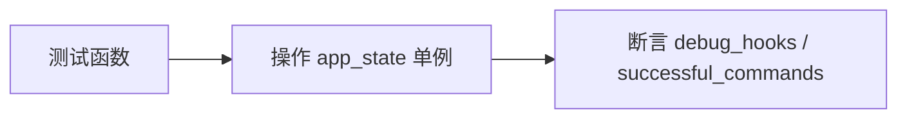

# 应用状态测试 <code>tests/state/test_app.py</code>

验证 `objection.state.app.app_state` 单例：默认调试钩子标志、`should_debug_hooks` 判断、命令历史添加与清空。

## 📋 模块概览

| 项目 | 值 |
| --- | --- |
| 文件路径 | `tests/state/test_app.py` |
| 被测对象 | `objection.state.app.app_state` |
| 用例数 | 4 |
| 框架 | pytest + unittest |

## 🎯 测试意图

- 确认 `should_debug_hooks()` 默认返回 False。
- 确认设置 `debug_hooks=True` 后 `should_debug_hooks()` 返回 True。
- 确认 `add_command_to_history` 追加命令到 `successful_commands`。
- 确认 `clear_command_history` 清空列表。`tearDown` 复位状态。

## 🧪 用例清单

| 用例 | 行号 | 验证点 |
| --- | --- | --- |
| test_app_should_not_debug_hooks_by_default | 11 | 默认 False |
| test_app_should_debug_hooks_if_true | 14 | 置 True 后返回 True |
| test_adds_command_to_history | 19 | 追加 1 条且内容正确 |
| test_clears_command_history | 25 | 清空后长度为 0 |

## ⚙️ 测试手法

直接操作 `app_state` 单例属性并调用方法，断言布尔/长度/内容。无 mock，无 capture。`tearDown` 强制复位 `debug_hooks=False`、`successful_commands=[]` 隔离用例。

关键代码 `tests/state/test_app.py:19`：

```python
def test_adds_command_to_history(self):
    app_state.add_command_to_history('foo')
    self.assertEqual(len(app_state.successful_commands), 1)
    self.assertEqual(app_state.successful_commands[0], 'foo')
```



## 🔍 源码索引

| 用例 | 位置 |
| --- | --- |
| test_app_should_not_debug_hooks_by_default | tests/state/test_app.py:11 |
| test_app_should_debug_hooks_if_true | tests/state/test_app.py:14 |
| test_adds_command_to_history | tests/state/test_app.py:19 |
| test_clears_command_history | tests/state/test_app.py:25 |

## 🔗 相关文档

- 对应被测模块文档：[/reference/state/app](/reference/state/app)
- 命令历史测试：[/reference/tests/commands/command-history](/reference/tests/commands/command-history)
