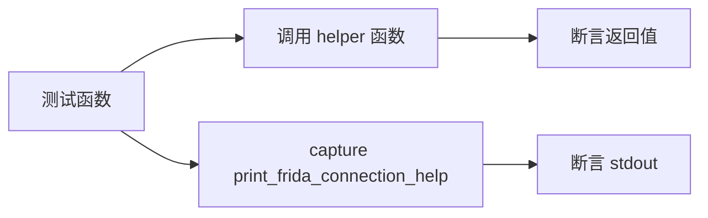

# 辅助函数测试 <code>tests/utils/test_helpers.py</code>

验证 `objection.utils.helpers` 的字符串处理工具：`pretty_concat` 截断、`sizeof_fmt` 字节格式化、`get_tokens` 引号感知分词、`clean_argument_flags` 去标志、`print_frida_connection_help` 连接帮助输出。

## 📋 模块概览

| 项目 | 值 |
| --- | --- |
| 文件路径 | `tests/utils/test_helpers.py` |
| 被测对象 | `objection.utils.helpers`（pretty_concat/sizeof_fmt/get_tokens/clean_argument_flags/print_frida_connection_help） |
| 用例数 | 8 |
| 框架 | pytest + unittest |

## 🎯 测试意图

- 确认 `pretty_concat` 短字符串原样返回，超长时右侧截断加 `...`，`left=True` 时左侧加 `...`。
- 确认 `sizeof_fmt(3000)` 输出 `2.9 KiB`。
- 确认 `get_tokens` 对无引号字符串按空白分词，对带引号字符串合并引号内内容，对未闭合引号返回占位列表。
- 确认 `clean_argument_flags` 移除 `--` 开头的标志。
- 确认 `print_frida_connection_help` 输出含 rooted/patched/serial/wiki 提示。

## 🧪 用例清单

| 用例 | 行号 | 验证点 |
| --- | --- | --- |
| test_pretty_concat_with_less_than_seventy_five_chars | 14 | 短字符串原样 |
| test_pretty_concat_with_more_than_max_chars | 19 | 右侧截断加 ... |
| test_pretty_concat_with_more_than_max_chars_to_the_left | 24 | 左侧加 ... |
| test_sizeof_formats_values | 29 | 3000 → 2.9 KiB |
| test_gets_tokens_without_quotes | 34 | 按空白分词 |
| test_gets_tokens_with_quotes | 39 | 合并引号内容 |
| test_gets_tokens_and_handles_missing_quotes | 44 | 未闭合引号返回占位 |
| test_cleans_argument_lists_with_flags | 49 | 移除 -- 标志 |
| test_prints_frida_connection_help | 53 | 输出连接帮助文本 |

## ⚙️ 测试手法

纯函数测试，直接调用断言返回值。`print_frida_connection_help` 用 `capture` 捕获 stdout 做精确字符串相等。无 mock。

关键代码 `tests/utils/test_helpers.py:39`：

```python
def test_gets_tokens_with_quotes(self):
    result = get_tokens('this is "a test"')
    self.assertEqual(result, ['this', 'is', 'a test'])
```



## 🔍 源码索引

| 用例 | 位置 |
| --- | --- |
| test_pretty_concat_with_less_than_seventy_five_chars | tests/utils/test_helpers.py:14 |
| test_pretty_concat_with_more_than_max_chars | tests/utils/test_helpers.py:19 |
| test_pretty_concat_with_more_than_max_chars_to_the_left | tests/utils/test_helpers.py:24 |
| test_sizeof_formats_values | tests/utils/test_helpers.py:29 |
| test_gets_tokens_without_quotes | tests/utils/test_helpers.py:34 |
| test_gets_tokens_with_quotes | tests/utils/test_helpers.py:39 |
| test_gets_tokens_and_handles_missing_quotes | tests/utils/test_helpers.py:44 |
| test_cleans_argument_lists_with_flags | tests/utils/test_helpers.py:49 |
| test_prints_frida_connection_help | tests/utils/test_helpers.py:53 |

## 🔗 相关文档

- 对应被测模块文档：[/reference/utils/helpers](/reference/utils/helpers)
