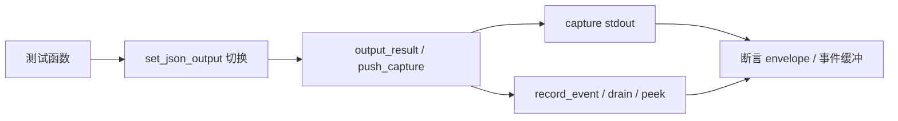

# 统一输出层测试 <code>tests/utils/test_output.py</code>

验证 `objection.utils.output` 的 `CommandResult`/`output_result`/`error_result`/`should_output_json`/`set_json_output` 与结果捕获栈，以及 `objection.utils.events` 的事件缓冲（record/drain/peek）。这是 objection 统一输出 schema 与 JSON envelope 的核心测试。

## 📋 模块概览

| 项目 | 值 |
| --- | --- |
| 文件路径 | `tests/utils/test_output.py` |
| 被测对象 | `objection.utils.output`（CommandResult/output_result/error_result/should_output_json/set_json_output/is_json_output/push_result_capture/pop_result_capture）+ `objection.utils.events`（record_event/drain_events/peek_events） |
| 用例数 | 15 |
| 框架 | pytest + unittest |

## 🎯 测试意图

- 确认 `CommandResult.to_dict('cmd')` 产出含 `status`/`command`/`result`/`jobs_created`/`warnings` 五键的 envelope。
- 确认默认值（status=ok/exit_code=0/jobs_created=[]/warnings=[]）与 `error_result` 助手。
- 确认 JSON 模式 `output_result` 输出可解析 envelope，人类模式打印 `human_text` 与 `Warning:` 行。
- 确认 `should_output_json` 同时尊重全局 `set_json_output` 与命令级 `--json` 参数。
- 确认结果捕获栈 `push_result_capture`/`pop_result_capture` 拦截输出不打印、空栈 pop 返回 None。
- 确认事件缓冲 record/drain/peek 语义，drain 清空、peek 不清空、人类模式忽略事件。

## 🧪 用例清单

| 用例 | 行号 | 验证点 |
| --- | --- | --- |
| test_to_dict_shape | 13 | envelope 五键且字段正确 |
| test_defaults | 21 | 默认值正确 |
| test_error_result_helper | 28 | error_result 状态/exit/human_text |
| test_json_mode_emits_envelope | 43 | JSON 模式可解析 envelope |
| test_human_mode_prints_human_text | 52 | 人类模式打印 human_text |
| test_human_mode_prints_warnings | 56 | 人类模式含 Warning: |
| test_should_output_json_respects_global_flag | 60 | 全局标志影响 |
| test_should_output_json_respects_arg_flag | 66 | --json 参数影响 |
| test_capture_intercepts_output | 81 | 捕获栈收集多条结果 |
| test_capture_does_not_print | 92 | 捕获模式不打印 |
| test_pop_when_empty_returns_none | 98 | 空栈 pop 返回 None |
| test_record_and_drain | 111 | record/drain 收集事件 |
| test_drain_clears_buffer | 119 | drain 后缓冲为空 |
| test_peek_does_not_clear | 125 | peek 不清空仍可 drain |
| test_record_ignored_in_human_mode | 134 | 人类模式忽略事件 |

## ⚙️ 测试手法

`set_json_output` 切换全局模式，`setUp`/`tearDown` 隔离到 False 或清理捕获栈残留（`while pop_result_capture() is not None: pass`）。渲染用例用 `capture(output_result, ...)` 捕获 stdout 后 `json.loads` 解析或字符串断言。捕获栈用例直接调用 `push_result_capture`/`pop_result_capture` 检查列表长度与字段。事件缓冲用例调用 `record_event`/`drain_events`/`peek_events` 断言 `events`/`remaining` 字段。

关键代码 `tests/utils/test_output.py:43`：

```python
def test_json_mode_emits_envelope(self):
    set_json_output(True)
    with capture(output_result, CommandResult(result={'x': 1}), 'cmd') as o:
        import json as _json
        payload = _json.loads(o)
    self.assertEqual(payload['status'], 'ok')
    self.assertEqual(payload['command'], 'cmd')
    self.assertEqual(payload['result'], {'x': 1})
```



## 🔍 源码索引

| 用例 | 位置 |
| --- | --- |
| test_to_dict_shape | tests/utils/test_output.py:13 |
| test_defaults | tests/utils/test_output.py:21 |
| test_error_result_helper | tests/utils/test_output.py:28 |
| test_json_mode_emits_envelope | tests/utils/test_output.py:43 |
| test_human_mode_prints_human_text | tests/utils/test_output.py:52 |
| test_human_mode_prints_warnings | tests/utils/test_output.py:56 |
| test_should_output_json_respects_global_flag | tests/utils/test_output.py:60 |
| test_should_output_json_respects_arg_flag | tests/utils/test_output.py:66 |
| test_capture_intercepts_output | tests/utils/test_output.py:81 |
| test_capture_does_not_print | tests/utils/test_output.py:92 |
| test_pop_when_empty_returns_none | tests/utils/test_output.py:98 |
| test_record_and_drain | tests/utils/test_output.py:111 |
| test_drain_clears_buffer | tests/utils/test_output.py:119 |
| test_peek_does_not_clear | tests/utils/test_output.py:125 |
| test_record_ignored_in_human_mode | tests/utils/test_output.py:134 |

## 🔗 相关文档

- 对应被测模块文档：[/reference/utils/output](/reference/utils/output)
- Agent JSON 模式测试：[/reference/tests/commands/agent-converted-json](/reference/tests/commands/agent-converted-json)
