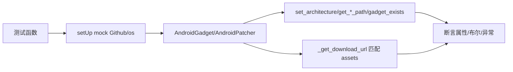

# Android 补丁器测试 <code>tests/utils/patchers/test_android.py</code>

验证 `objection.utils.patchers.android` 的 `AndroidGadget` 与 `AndroidPatcher`：架构设置/校验、Frida 库路径、gadget 存在性、下载 URL 匹配、Patcher 初始化与 APK source 设置。

## 📋 模块概览

| 项目 | 值 |
| --- | --- |
| 文件路径 | `tests/utils/patchers/test_android.py` |
| 被测对象 | `objection.utils.patchers.android.AndroidGadget`/`AndroidPatcher` |
| 用例数 | 12 |
| 框架 | pytest + unittest + mock |

## 🎯 测试意图

- 确认 `set_architecture` 设置并返回 self（链式），非法架构抛异常。
- 确认 `get_architecture`/`get_frida_library_path`（含 `.objection/android/x86/libfrida-gadget.so`），未设架构时抛异常。
- 确认 `gadget_exists` 依 `os.path.exists` 返回布尔，未设架构抛异常。
- 确认 `_get_download_url` 从 GitHub assets 匹配架构对应 URL，无匹配抛异常。
- 确认 `AndroidPatcher` 初始化设 apk_source/apk_temp_directory/keystore 等属性，`set_apk_source` 设置 apk_source 并返回 self。

## 🧪 用例清单

| 用例 | 行号 | 验证点 |
| --- | --- | --- |
| test_sets_architecture | 35 | set_architecture('x86') 后属性正确 |
| test_raises_exception_with_invalid_architecture | 39 | 非法架构抛异常 |
| test_sets_architecture_and_returns_context | 43 | 返回 AndroidGadget 类型 |
| test_gets_architecture_when_set | 47 | get_architecture 返回 'x86' |
| test_gets_frida_library_path | 53 | 路径含 .objection/android/x86 |
| test_fails_to_get_frida_library_path_without_architecture | 59 | 未设架构抛异常 |
| test_checks_if_gadget_exists_if_it_really_exists | 64 | exists=True 返回 True |
| test_checks_if_gadget_exists_if_it_really_does_not_exist | 73 | exists=False 返回 False |
| test_check_if_gadget_exists_fails_without_architecture | 81 | 未设架构抛异常 |
| test_can_find_download_url_for_gadget | 85 | 匹配 x86 下载 URL |
| test_throws_exception_when_download_url_could_not_be_determined | 98 | arm 无匹配抛异常 |
| test_inits_patcher | 114 | 初始化属性正确且 keystore 真实存在 |
| test_set_android_apk_source | 130 | set_apk_source 设 apk_source 并返回 self |

## ⚙️ 测试手法

`AndroidGadget.setUp` 以 `@mock.patch('objection.utils.patchers.android.Github')` + `os` 构造实例，并预置 `github_get_assets_sample`（含 `frida-gadget-10.6.8-android-x86.so.xz`）。`_get_download_url` 用例注入 `mock_github.get_assets` 返回样本后断言 URL 字符串或异常。`AndroidPatcher` 用例以 `@mock.patch` 替换 `__init__`/`__del__`/`tempfile`/`os`，绕过基类初始化与析构，断言实例属性（含 `os.path.exists(patcher.keystore)` 真实文件检查）。

关键代码 `tests/utils/patchers/test_android.py:85`：

```python
def test_can_find_download_url_for_gadget(self):
    mock_github = mock.MagicMock()
    mock_github.get_assets.return_value = self.github_get_assets_sample
    self.android_gadget.github = mock_github
    self.android_gadget.architecture = 'x86'
    url = self.android_gadget._get_download_url()
    self.assertEqual(url, 'https://github.com/frida/frida/releases/download/'
                          '10.6.8/frida-gadget-10.6.8-android-x86.so.xz')
```



## 🔍 源码索引

| 用例 | 位置 |
| --- | --- |
| test_sets_architecture | tests/utils/patchers/test_android.py:35 |
| test_raises_exception_with_invalid_architecture | tests/utils/patchers/test_android.py:39 |
| test_sets_architecture_and_returns_context | tests/utils/patchers/test_android.py:43 |
| test_gets_architecture_when_set | tests/utils/patchers/test_android.py:47 |
| test_gets_frida_library_path | tests/utils/patchers/test_android.py:53 |
| test_fails_to_get_frida_library_path_without_architecture | tests/utils/patchers/test_android.py:59 |
| test_checks_if_gadget_exists_if_it_really_exists | tests/utils/patchers/test_android.py:64 |
| test_checks_if_gadget_exists_if_it_really_does_not_exist | tests/utils/patchers/test_android.py:73 |
| test_check_if_gadget_exists_fails_without_architecture | tests/utils/patchers/test_android.py:81 |
| test_can_find_download_url_for_gadget | tests/utils/patchers/test_android.py:85 |
| test_throws_exception_when_download_url_could_not_be_determined | tests/utils/patchers/test_android.py:98 |
| test_inits_patcher | tests/utils/patchers/test_android.py:114 |
| test_set_android_apk_source | tests/utils/patchers/test_android.py:130 |

## 🔗 相关文档

- 对应被测模块文档：[/reference/utils/patchers/android](/reference/utils/patchers/android)
- 基类测试：[/reference/tests/utils/patchers/base](/reference/tests/utils/patchers/base)
