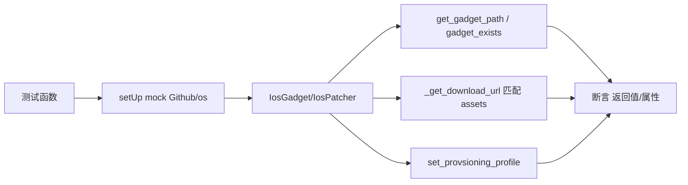

# iOS 补丁器测试 <code>tests/utils/patchers/test_ios.py</code>

验证 `objection.utils.patchers.ios` 的 `IosGadget` 与 `IosPatcher`：gadget 路径获取、存在性检查、从 GitHub assets 匹配下载 URL、设置 provisioning profile。

## 📋 模块概览

| 项目 | 值 |
| --- | --- |
| 文件路径 | `tests/utils/patchers/test_ios.py` |
| 被测对象 | `objection.utils.patchers.ios.IosGadget`/`IosPatcher` |
| 用例数 | 4 |
| 框架 | pytest + unittest + mock |

## 🎯 测试意图

- 确认 `get_gadget_path` 返回 `ios_dylib_gadget_path` 属性值。
- 确认 `gadget_exists` 依 `os.path.exists` 返回布尔。
- 确认 `_get_download_url` 从 GitHub assets 匹配 iOS universal dylib 下载 URL。
- 确认 `IosPatcher.set_provsioning_profile`（注：源码拼写为 provsioning）设置 `provision_file` 属性。

## 🧪 用例清单

| 用例 | 行号 | 验证点 |
| --- | --- | --- |
| test_gets_gadget_path | 34 | 返回设定的 dylib 路径 |
| test_checks_if_gadget_exists | 42 | exists=True 返回 True |
| test_can_find_asset_download_url | 49 | 匹配 iOS dylib URL |
| test_sets_provisioning_profile | 65 | 设 provision_file 属性 |

## ⚙️ 测试手法

`IosGadget.setUp` 以 `@mock.patch('objection.utils.patchers.ios.Github')` + `android.os` 构造实例，预置 `github_get_assets_sample`（含 `frida-gadget-10.6.8-ios-universal.dylib.xz`）。`gadget_exists` 用例 mock `os.path.exists=True`。`_get_download_url` 用例注入 `mock_github.get_assets` 返回样本后断言 URL。`IosPatcher` 用例以 `@mock.patch` 替换 `__init__`/`__del__`/`click.secho` 绕过初始化，调用 `set_provsioning_profile` 断言 `provision_file` 属性。

关键代码 `tests/utils/patchers/test_ios.py:49`：

```python
def test_can_find_asset_download_url(self):
    mock_github = mock.MagicMock()
    mock_github.get_assets.return_value = self.github_get_assets_sample
    self.ios_gadget.github = mock_github
    result = self.ios_gadget._get_download_url()
    self.assertEqual(result, 'https://github.com/frida/frida/releases/download/'
                             'frida-gadget-10.6.8-ios-universal.dylib.xz')
```



## 🔍 源码索引

| 用例 | 位置 |
| --- | --- |
| test_gets_gadget_path | tests/utils/patchers/test_ios.py:34 |
| test_checks_if_gadget_exists | tests/utils/patchers/test_ios.py:42 |
| test_can_find_asset_download_url | tests/utils/patchers/test_ios.py:49 |
| test_sets_provisioning_profile | tests/utils/patchers/test_ios.py:65 |

## 🔗 相关文档

- 对应被测模块文档：[/reference/utils/patchers/ios](/reference/utils/patchers/ios)
- Android 补丁器测试：[/reference/tests/utils/patchers/android](/reference/tests/utils/patchers/android)
- 移动包补丁测试：[/reference/tests/commands/mobile-packages](/reference/tests/commands/mobile-packages)
