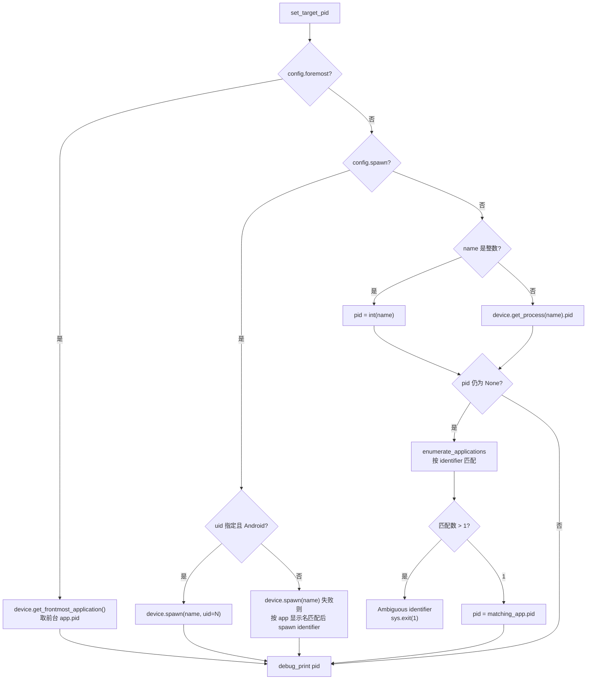
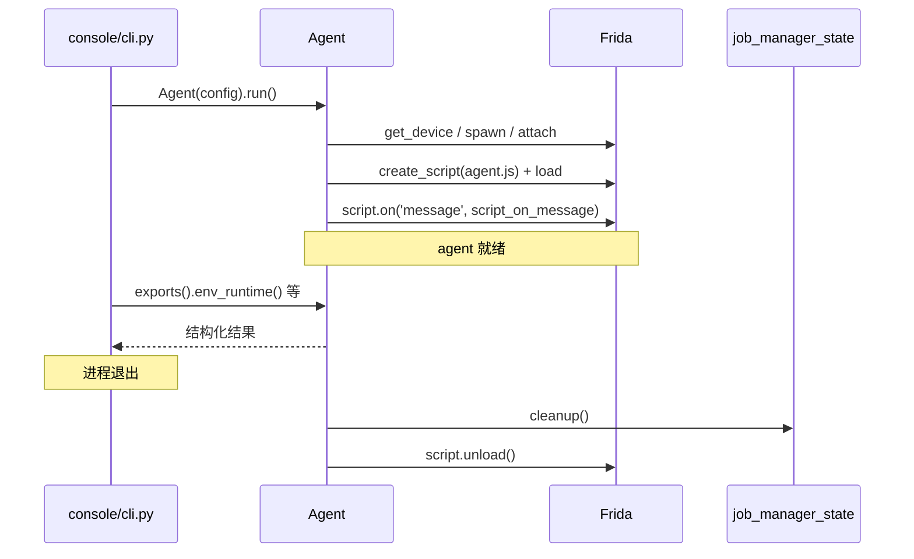

# Agent 生命周期管理 <code>objection/utils/agent.py</code>

封装 objection 与 Frida 之间的全部交互：选择设备、定位/拉起目标进程、注入编译好的 `agent.js`、注册消息回调、暴露 RPC exports。它是 REPL/CLI 命令层通往运行时 Hook 引擎的唯一桥梁，所有命令最终都通过 `Agent.exports()` 调到 agent 内部方法。

## 📋 模块概览
| 项目 | 值 |
| --- | --- |
| 文件路径 | `objection/utils/agent.py` |
| 类型 | 工具（Frida 生命周期管理） |
| 被谁调用 | `state/connection.py`（持有 agent 实例）、`console/cli.py`（启动时 `run()`）、`console/repl.py`、各 commands 模块经 `state_connection.get_agent()/get_api()` 取用 |
| 依赖 | `frida`、`click`、`state.app.app_state`、`state.connection.state_connection`、`state.device`、`state.jobs.job_manager_state`、`utils.helpers.debug_print`、`utils.events.record_event` |

## 🎯 解决的问题
- 统一封装 Frida 的「设备枚举 → 进程定位/拉起 → attach → create_script → load → resume」多步编排，让上层不必直接面对 frida-python API。
- 处理多种目标定位方式：`spawn` 新进程、`foremost` 取前台应用、按 PID、按进程名、按包名/identifier、按 app 显示名，含多匹配歧义检测。
- 把 Frida 的 `script.on('message')` 与 `session.on('detached')` 回调收敛到 `OutputHandlers`，并在 JSON 模式下把异步消息额外缓冲到事件队列供 Agent 轮询。
- 在退出时通过 `atexit` 注册 teardown，卸载脚本并让 job_manager 清理后台 Hook Job。

## 🏗️ 核心结构

### `AgentConfig` — 注入配置数据类
源码：[`objection/utils/agent.py:19`](https://github.com/android-security-engineer/objection-skills/blob/master/objection/utils/agent.py#L19)

```python
@dataclass
class AgentConfig(object):
    name: str
    host: str = None
    port: int = None
    device_type: str = 'usb'
    device_id: str = None
    foremost: bool = False
    spawn: bool = False
    pause: bool = True
    debugger: bool = False
    uid: int = None
```

由 `console/cli.py` 在解析参数后构造，传入 `Agent(config=...)`。`spawn`/`pause` 的组合决定进程是「拉起后暂停等待 Hook 就绪」还是「直接放行」；`uid` 仅 Android 生效，用于以指定 uid 拉起进程。

### `OutputHandlers` — Frida 回调集合
源码：[`objection/utils/agent.py:35`](https://github.com/android-security-engineer/objection-skills/blob/master/objection/utils/agent.py#L35)

三个回调：
- `device_output()` / `device_lost()`：设备级事件占位（默认空实现）。
- `session_on_detached(message, crash)`：会话脱落时打印脱落原因与 Frida 12.3+ 的 crash 报告。
- `script_on_message(message, data)`：agent 消息入口。

`script_on_message` 是 Agent JSON 化改造的关键节点：

```python
@staticmethod
def script_on_message(message: dict, data):
    try:
        if app_state.should_debug():
            # ... 打印原始消息 JSON
        # 缓冲异步事件，供 AI Agent / HTTP API 轮询（仅 JSON 模式生效）
        from .events import record_event
        record_event(message, data)
        # ... 处理 payload 打印
```

源码：[`objection/utils/agent.py:78`](https://github.com/android-security-engineer/objection-skills/blob/master/objection/utils/agent.py#L78)。注意此处用函数内延迟导入 `from .events import record_event`，避免 `agent` ↔ `events` 模块循环依赖——`events` 反向依赖 `output.is_json_output`，而 `output` 不依赖 `agent`，这条延迟导入链是安全的。

### `Agent` — 生命周期主体
源码：[`objection/utils/agent.py:116`](https://github.com/android-security-engineer/objection-skills/blob/master/objection/utils/agent.py#L116)

类属性持有整条 Frida 句柄链：`device` → `session` → `script`，外加 `pid` 与 `resumed` 状态。

#### `__init__` — 定位 agent.js 并注册退出清理
源码：[`objection/utils/agent.py:131`](https://github.com/android-security-engineer/objection-skills/blob/master/objection/utils/agent.py#L131)

```python
self.agent_path = Path(__file__).parent.parent / 'agent.js'
if not self.agent_path.exists():
    raise Exception(f'Unable to locate Objection agent sources at: {self.agent_path}. ...')
```

`agent.js` 是预先编译好的 Frida 脚本（位于 objection 包根目录）。开发安装若未构建会在此抛错。`atexit.register(self.teardown)` 确保进程退出时统一卸载。

#### `set_device` — 设备选择
源码：[`objection/utils/agent.py:159`](https://github.com/android-security-engineer/objection-skills/blob/master/objection/utils/agent.py#L159)

按优先级解析目标设备：
1. `device_id` 指定 → `frida.get_device(id)`。
2. `host` 或 `device_type=='remote'` → 远程设备（`host:port` 或默认 `127.0.0.1:port`）。
3. `device_type` 指定（默认 `usb`）→ 枚举设备按 type 匹配。
4. 兜底 `frida.get_local_device()`。

并注册 `device.on('output')` / `device.on('lost')` 回调。

#### `set_target_pid` — 进程定位（最复杂的方法）
源码：[`objection/utils/agent.py:194`](https://github.com/android-security-engineer/objection-skills/blob/master/objection/utils/agent.py#L194)

按 `foremost` → `spawn` → 已有进程 的优先级解析 PID：



`spawn` 路径会把 `self.resumed = False`，等待后续 `resume()` 调用，给 Hook 装载留窗口。

#### `attach` — 注入脚本
源码：[`objection/utils/agent.py:280`](https://github.com/android-security-engineer/objection-skills/blob/master/objection/utils/agent.py#L280)

```python
self.session = self.device.attach(self.pid)
self.session.on('detached', self.handlers.session_on_detached)
if self.config.debugger:
    self.script = self.session.create_script(source=self._get_agent_source(), runtime='v8')
    self.script.enable_debugger()
else:
    self.script = self.session.create_script(source=self._get_agent_source())
self.script.on('message', self.handlers.script_on_message)
self.script.load()
```

`debugger=True` 时强制 V8 runtime 并启用 Chrome DevTools 调试（`chrome://inspect`）。`_get_agent_source()` 把 `agent.js` 整文件读成字符串塞给 `create_script`。

#### `attach_script` — 注入额外脚本作为 Job
源码：[`objection/utils/agent.py:308`](https://github.com/android-security-engineer/objection-skills/blob/master/objection/utils/agent.py#L308)

为 `android heap invoke`、自定义脚本运行等场景提供独立 session+script，并注册进 `job_manager_state` 以便统一卸载。

#### `update_device_state` — 推断平台
源码：[`objection/utils/agent.py:325`](https://github.com/android-security-engineer/objection-skills/blob/master/objection/utils/agent.py#L325)

优先用 `device.query_system_parameters()['os']['id']` 判定 iOS/Android；若不是这两者（如 Windows/macOS 桌面进程），则回退调用 `self.exports().env_runtime()` 让 agent 自报运行时。结果写入 `device_state`，决定后续命令走 iOS 还是 Android 分支。

#### `resume` / `exports` / `run` / `teardown`
- `resume()`：[`objection/utils/agent.py:350`](https://github.com/android-security-engineer/objection-skills/blob/master/objection/utils/agent.py#L350)，仅当 `resumed=False` 时 `device.resume(pid)`。
- `exports()`：[`objection/utils/agent.py:366`](https://github.com/android-security-engineer/objection-skills/blob/master/objection/utils/agent.py#L366)，返回 `script.exports_sync`，这是命令层调用 agent RPC 的入口。
- `run()`：[`objection/utils/agent.py:378`](https://github.com/android-security-engineer/objection-skills/blob/master/objection/utils/agent.py#L378)，编排 `set_device → set_target_pid → attach → update_device_state → (条件)resume`。
- `teardown()`：[`objection/utils/agent.py:397`](https://github.com/android-security-engineer/objection-skills/blob/master/objection/utils/agent.py#L397)，先 `job_manager_state.cleanup()` 让 Job 自停，再 `script.unload()`，捕获 `frida.InvalidOperationError`。



## ⚙️ 实现要点
- **`agent.js` 是预编译产物**：源码在 objection 仓库的 agent 子工程（TypeScript），发行版随包附带编译好的 `agent.js`。开发安装需自行构建，否则 `__init__` 抛错。
- **`exports_sync` 而非 `exports`**：`exports()` 返回 `script.exports_sync`（同步版），让命令层可以 `rpc.android_hooking_list_classes()` 直接拿到结果，而非 Promise。
- **Agent 友好性改造**：`script_on_message` 中追加 `record_event(message, data)` 调用，把人类模式下本来只打印的异步消息在 JSON 模式下额外入队，供 `GET /events/poll` 取回。这是「同一回调，双消费者」模式：人类看 stdout，Agent 看事件队列。
- **延迟导入避循环**：`from .events import record_event` 写在函数体内而非模块顶，因为 `events` 依赖 `output.is_json_output`，而 `output` 又被 `agent` 依赖——顶部导入会成环。
- **`uid` 仅 Android**：`set_target_pid` 中显式校验 `query_system_parameters()['os']['id'] != 'android'` 时抛错，防止在 iOS 上误用。
- **V8 调试**：`debugger` 分支用 `runtime='v8'`，Frida 默认 runtime 视版本而定，显式指定保证 `enable_debugger()` 行为一致。

## 🔍 源码索引
| 符号 | 位置 |
| --- | --- |
| `AgentConfig` | [`objection/utils/agent.py:19`](https://github.com/android-security-engineer/objection-skills/blob/master/objection/utils/agent.py#L19) |
| `OutputHandlers` | [`objection/utils/agent.py:35`](https://github.com/android-security-engineer/objection-skills/blob/master/objection/utils/agent.py#L35) |
| `OutputHandlers.session_on_detached` | [`objection/utils/agent.py:44`](https://github.com/android-security-engineer/objection-skills/blob/master/objection/utils/agent.py#L44) |
| `OutputHandlers.script_on_message` | [`objection/utils/agent.py:78`](https://github.com/android-security-engineer/objection-skills/blob/master/objection/utils/agent.py#L78) |
| `Agent` | [`objection/utils/agent.py:116`](https://github.com/android-security-engineer/objection-skills/blob/master/objection/utils/agent.py#L116) |
| `Agent.__init__` | [`objection/utils/agent.py:131`](https://github.com/android-security-engineer/objection-skills/blob/master/objection/utils/agent.py#L131) |
| `_get_agent_source` | [`objection/utils/agent.py:147`](https://github.com/android-security-engineer/objection-skills/blob/master/objection/utils/agent.py#L147) |
| `set_device` | [`objection/utils/agent.py:159`](https://github.com/android-security-engineer/objection-skills/blob/master/objection/utils/agent.py#L159) |
| `set_target_pid` | [`objection/utils/agent.py:194`](https://github.com/android-security-engineer/objection-skills/blob/master/objection/utils/agent.py#L194) |
| `attach` | [`objection/utils/agent.py:280`](https://github.com/android-security-engineer/objection-skills/blob/master/objection/utils/agent.py#L280) |
| `attach_script` | [`objection/utils/agent.py:308`](https://github.com/android-security-engineer/objection-skills/blob/master/objection/utils/agent.py#L308) |
| `update_device_state` | [`objection/utils/agent.py:325`](https://github.com/android-security-engineer/objection-skills/blob/master/objection/utils/agent.py#L325) |
| `resume` | [`objection/utils/agent.py:350`](https://github.com/android-security-engineer/objection-skills/blob/master/objection/utils/agent.py#L350) |
| `exports` | [`objection/utils/agent.py:366`](https://github.com/android-security-engineer/objection-skills/blob/master/objection/utils/agent.py#L366) |
| `run` | [`objection/utils/agent.py:378`](https://github.com/android-security-engineer/objection-skills/blob/master/objection/utils/agent.py#L378) |
| `teardown` | [`objection/utils/agent.py:397`](https://github.com/android-security-engineer/objection-skills/blob/master/objection/utils/agent.py#L397) |

## 🔗 相关文档
- [整体架构](/guide/architecture)
- [RPC 通信机制](/guide/rpc)
- [面向 AI Agent 使用](/guide/agent-usage)
- [HTTP API 端点](/guide/agent-http)
