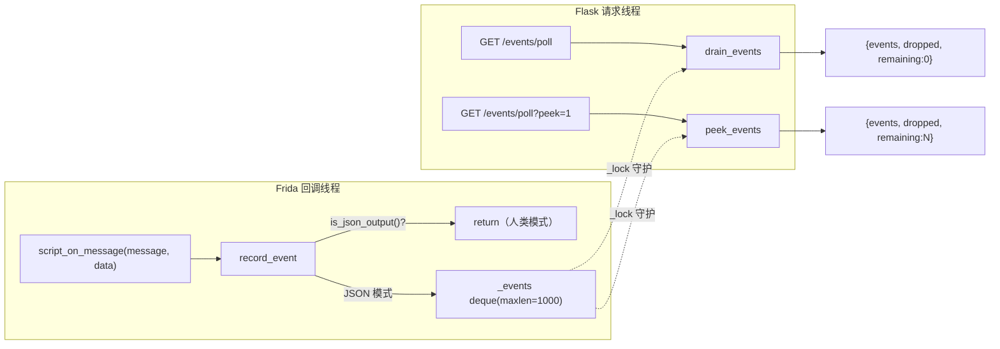

# 异步事件缓冲 <code>objection/utils/events.py</code>

为 AI Agent / HTTP API 提供一个可轮询的进程内有界事件队列。Frida 的 Hook 命中、Job 注册等异步结果通过 `script.on('message')` 回调到达，人类模式下直接打印终端；但 Agent 模式需要一个能被 `GET /events/poll` 拉取的缓冲区，本模块就是这个缓冲区。

## 📋 模块概览
| 项目 | 值 |
| --- | --- |
| 文件路径 | `objection/utils/events.py` |
| 类型 | 工具（进程内事件队列，新增模块） |
| 被谁调用 | `utils/agent.py` 的 `OutputHandlers.script_on_message`（入队）、`api/agent_endpoints.py` 的 `/events/poll` 与 `/state`（出队） |
| 依赖 | `collections.deque`、`threading.Lock`、`utils.output.is_json_output` |

## 🎯 解决的问题
- **Agent 无法「收」异步消息**：Frida 的消息回调是 push 模型，Agent 通过 HTTP 调用 objection 是 pull 模型，两者节奏不匹配。需要一个缓冲区把 push 进来的消息存住，等 Agent 来 pull。
- **避免 Hook 风暴耗尽内存**：Hook 命中频率可能极高（如 `android hooking watch class` 命中频繁调用的方法），队列必须有上限且能优雅丢弃。
- **人类模式不重复缓冲**：人类模式下消息已直接打印到 stdout，再缓冲就是重复劳动；用 `is_json_output()` 守门，仅在 Agent JSON 模式下记录。
- **线程安全**：Frida 回调与 Flask 请求线程并发访问队列，需要锁。

## 🏗️ 核心结构

### 模块级全局状态
源码：`objection/utils/events.py:21`

```python
_MAX_EVENTS = 1000
_events: deque = deque(maxlen=_MAX_EVENTS)
_lock = Lock()
_dropped = 0
```

- `_MAX_EVENTS = 1000`：有界队列上限，保留最近 1000 条事件。
- `_events`：`deque(maxlen=...)` 在满员后追加会自动从左侧挤掉最旧元素——但为了统计丢弃量，`record_event` 手动检测满员并 `_dropped += 1`，再 `append`（append 触发自动挤掉，计数与丢弃一致）。
- `_lock`：守护 `_events` 与 `_dropped` 的并发访问。
- `_dropped`：累计丢弃计数，随 `drain_events` 一起清零返回。

### `record_event` — 入队
源码：`objection/utils/events.py:29`

```python
def record_event(message: dict, data=None) -> None:
    global _dropped
    if not is_json_output():
        return
    with _lock:
        if len(_events) == _events.maxlen:
            _dropped += 1
        _events.append({
            'message': message,
            'data': data.decode('utf-8', 'replace') if isinstance(data, (bytes, bytearray)) else data,
        })
```

设计要点：
- **JSON 模式守门**：`is_json_output()` 为 False 时直接 return，不缓冲——这是「同一回调双消费者」的分流点，人类模式零开销。
- **二进制 data 解码**：Frida 的 `send(..., data)` 可携带二进制（如内存 dump），这里用 `utf-8` + `replace` 错误处理解码为字符串；非 bytes 原样保留。
- **丢弃计数先于 append**：先判断 `len == maxlen` 再 append，这样 `_dropped` 准确反映「本次 append 挤掉了一条最旧事件」。

### `drain_events` — 取出并清空
源码：`objection/utils/events.py:53`

```python
def drain_events() -> dict:
    global _dropped
    with _lock:
        events = list(_events)
        _events.clear()
        dropped = _dropped
        _dropped = 0
    return {'events': events, 'dropped': dropped, 'remaining': 0}
```

返回固定 schema：`events`（列表）、`dropped`（自上次 drain 累计丢弃数）、`remaining`（恒为 0，因为已清空）。`/events/poll` 默认走这条路径。

### `peek_events` — 查看不清空
源码：`objection/utils/events.py:75`

```python
def peek_events() -> dict:
    with _lock:
        return {
            'events': list(_events),
            'dropped': _dropped,
            'remaining': len(_events),
        }
```

与 `drain` 的区别：不清空、`remaining` 反映当前队列长度、`dropped` 不清零。`/events/poll?peek=1` 走这条路径，供 Agent「先看一眼再决定是否消费」。



## ⚙️ 实现要点
- **全局单例队列**：模块级 `_events` / `_dropped` / `_lock` 是进程内单例，跨命令、跨请求共享。这意味着一次 objection 会话内所有 Hook 命中的事件都汇入同一队列，Agent 按需轮询即可。
- **满员即丢最旧**：`deque(maxlen=N)` 的语义是「追加时若满则从左侧丢弃」，与「保留最近 N 条」的语义一致——对 Agent 而言，最近的事件比最早的更有价值。
- **`dropped` 是诊断信号**：若 Agent 看到 `dropped > 0`，说明 Hook 命中速度超过轮询速度，应缩短轮询间隔或缩小 Hook 范围。
- **仅在 JSON 模式缓冲**：人类模式 `is_json_output()` 为 False，`record_event` 立即 return，零内存开销。这也意味着若 Agent 未启用 JSON 模式（如直接用 `objection run` 而非 `objection api`），事件队列始终为空——必须先 `set_json_output(True)`。
- **解码而非透传 bytes**：Frida 二进制 data 若直接进 JSON 序列化会报错，故统一解码为字符串；需要原始字节的命令（如内存 dump）应走专门端点而非事件队列。

## 🔍 源码索引
| 符号 | 位置 |
| --- | --- |
| `_MAX_EVENTS` | `objection/utils/events.py:22` |
| `_events` | `objection/utils/events.py:24` |
| `_lock` | `objection/utils/events.py:25` |
| `_dropped` | `objection/utils/events.py:26` |
| `record_event` | `objection/utils/events.py:29` |
| `drain_events` | `objection/utils/events.py:53` |
| `peek_events` | `objection/utils/events.py:75` |

## 🔗 相关文档
- [整体架构](/guide/architecture)
- [RPC 通信机制](/guide/rpc)
- [面向 AI Agent 使用](/guide/agent-usage)
- [HTTP API 端点](/guide/agent-http)
