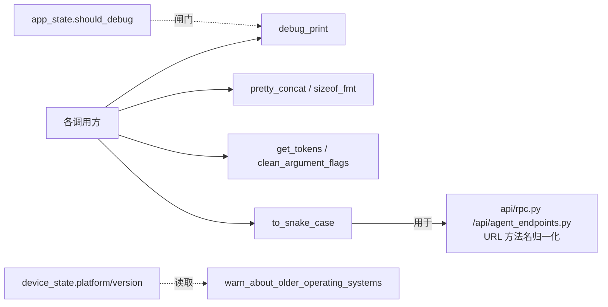

# 通用辅助函数 <code>objection/utils/helpers.py</code>

一组无状态的小工具函数：调试打印、字符串截断、字节大小格式化、shell 风格分词、参数清洗、驼峰转下划线、Frida 连接帮助文本、老系统版本告警。被 utils/agent、api/rpc、commands 等几乎全模块复用。

## 📋 模块概览
| 项目 | 值 |
| --- | --- |
| 文件路径 | `objection/utils/helpers.py` |
| 类型 | 工具（纯函数集合） |
| 被谁调用 | `utils/agent.py`（`debug_print`）、`api/rpc.py` 与 `api/agent_endpoints.py`（`to_snake_case`）、`commands/*.py`（`pretty_concat`、`get_tokens`、`clean_argument_flags`）、`utils/patchers/android.py`（`debug_print`）等 |
| 依赖 | `re`、`shlex`、`click`、`packaging.version.Version`、`state.app.app_state`、`state.device.device_state` |

## 🎯 解决的问题
- 提供受 `app_state.debug` 控制的统一调试打印入口，避免各模块自行判断。
- 处理 REPL 输入的 shell 风格分词（含未闭合引号的容错）。
- 统一驼峰方法名转下划线，让 HTTP `/rpc/invoke/<method>` 的 URL 大小写不敏感。
- 在低版本 Android/iOS 上发出兼容性告警，提示部分 Hook 可能失败。

## 🏗️ 核心结构

### `debug_print` — 调试日志
源码：`objection/utils/helpers.py:10`

```python
def debug_print(message: str) -> None:
    if app_state.should_debug():
        click.secho('[debug] {message}'.format(message=message), dim=True)
```

全模块统一的调试输出闸门，`dim=True` 让其在终端里视觉弱化。被 `agent.py`、`patchers/android.py` 等广泛调用。

### `pretty_concat` — 截断加省略号
源码：`objection/utils/helpers.py:23`

截断字符串到 `at_most` 长度，尾部或头部加 `...`。`left=True` 时保留尾部（适合显示文件路径末段）。用于命令输出中对长字符串的展示控制。

### `sizeof_fmt` — 字节可读化
源码：`objection/utils/helpers.py:47`

按 1024 进制把字节数格式化为 `3.1 KiB`、`12.5 MiB` 等。用于 `memory list` 等命令展示内存区段大小。

### `get_tokens` — shell 风格分词
源码：`objection/utils/helpers.py:59`

```python
def get_tokens(text: str) -> list:
    try:
        tokens = shlex.split(text)
    except ValueError:
        tokens = ['lajfhlaksjdfhlaskjfhafsdlkjh']  # 不会匹配任何命令的占位串
    return tokens
```

REPL 输入分词。`shlex` 在遇到未闭合引号时抛 `ValueError`（用户正在输入带引号的参数中途），这里捕获后返回一个随机占位串，避免 REPL 在半输入态崩掉。

### `clean_argument_flags` — 去除 `--` 标志
源码：`objection/utils/helpers.py:83`

过滤掉以 `--` 开头的参数，返回纯位置参数列表。供命令解析时区分 flag 与 value。

### `to_snake_case` — 驼峰转下划线
源码：`objection/utils/helpers.py:97`

```python
def to_snake_case(w: str) -> str:
    s1 = re.sub('(.)([A-Z][a-z]+)', r'\1_\2', w)
    return re.sub('([a-z0-9])([A-Z])', r'\1_\2', s1).lower()
```

两步正则实现 camelCase → snake_case。`api/rpc.py` 与 `api/agent_endpoints.py` 用它把 URL 里的方法名（如 `androidHookingListClasses`）归一化为 agent exports 的下划线命名（`android_hooking_list_classes`），让 HTTP 调用对大小写不敏感。

### `print_frida_connection_help` — 连接排错指引
源码：`objection/utils/helpers.py:109`

在连接失败时打印多色帮助文本：提示 root/越狱设备用 `--gadget`，非 root 设备跑 patched 应用并保持前台，多设备用 `--serial`，并指向 wiki。被 CLI 启动失败路径调用。

### `warn_about_older_operating_systems` — 版本告警
源码：`objection/utils/helpers.py:129`

```python
android_supported = '5'
ios_supported = '9'
if platform == Android and Version(version) < Version(android_supported):
    click.secho('Warning: ...', fg='yellow')
if platform == Ios and Version(version) < Version(ios_supported):
    click.secho('Warning: ...', fg='yellow')
```

读取 `device_state.platform` 与 `version`，若 Android < 5 或 iOS < 9 发黄色告警。`packaging.version.Version` 做语义化比较，避免字符串比较的坑。



## ⚙️ 实现要点
- **纯函数无副作用**：除 `debug_print`（读 `app_state`）与两个告警函数（`click.secho` 输出）外，其余函数都是纯转换，易测试。
- **`get_tokens` 的容错设计**：REPL 在用户逐字符输入带引号参数时，未闭合引号是正常中间态，不能因分词失败而中断会话——返回一个不会匹配任何命令的占位串是「优雅降级」。
- **`to_snake_case` 两步正则**：单步正则无法同时处理 `XMLParser` → `xml_parser` 与 `parseXML` → `parse_xml` 两种边界，两步分别处理「小写/数字后跟大写」与「大写后跟小写」两种连写模式。
- **版本比较用 `packaging.Version`**：而非字符串比较或 `split('.')`，正确处理 `10 > 9` 这类语义。

## 🔍 源码索引
| 符号 | 位置 |
| --- | --- |
| `debug_print` | `objection/utils/helpers.py:10` |
| `pretty_concat` | `objection/utils/helpers.py:23` |
| `sizeof_fmt` | `objection/utils/helpers.py:47` |
| `get_tokens` | `objection/utils/helpers.py:59` |
| `clean_argument_flags` | `objection/utils/helpers.py:83` |
| `to_snake_case` | `objection/utils/helpers.py:97` |
| `print_frida_connection_help` | `objection/utils/helpers.py:109` |
| `warn_about_older_operating_systems` | `objection/utils/helpers.py:129` |

## 🔗 相关文档
- [整体架构](/guide/architecture)
- [RPC 通信机制](/guide/rpc)
