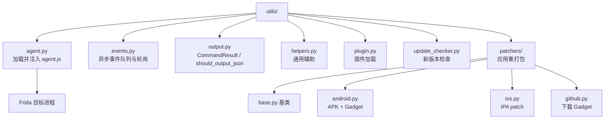

# ⚙️ 工具层文档

`objection/utils/` 提供 agent.js 注入、事件轮询、输出格式化、插件加载、版本检查与 APK/IPA patcher 等工具能力。本分区逐文件讲解。

## 🗺️ 工具层结构

## 📂 文件清单

### 通用工具

| 文档 | 源码 | 职责 |
| --- | --- | --- |
| [agent](/reference/utils/agent) | `utils/agent.py` | 加载并注入 `agent.js` |
| [events](/reference/utils/events) | `utils/events.py` | 异步事件队列与轮询 |
| [helpers](/reference/utils/helpers) | `utils/helpers.py` | 通用辅助函数 |
| [output](/reference/utils/output) | `utils/output.py` | `CommandResult` / `should_output_json` |
| [plugin](/reference/utils/plugin) | `utils/plugin.py` | Python 插件加载 |
| [update-checker](/reference/utils/update-checker) | `utils/update_checker.py` | 新版本检查 |

### Patcher（应用重打包）

| 文档 | 源码 | 职责 |
| --- | --- | --- |
| [patchers/base](/reference/utils/patchers/base) | `utils/patchers/base.py` | patcher 基类 |
| [patchers/android](/reference/utils/patchers/android) | `utils/patchers/android.py` | APK patch（注入 Frida Gadget） |
| [patchers/ios](/reference/utils/patchers/ios) | `utils/patchers/ios.py` | IPA patch |
| [patchers/github](/reference/utils/patchers/github) | `utils/patchers/github.py` | 从 GitHub 下载 Gadget |

## 🔗 相关文档

- [APK Patch（功能详解）](/features/patcher)
- [HTTP API 端点](/guide/agent-http)
- [面向 AI Agent 使用](/guide/agent-usage)
