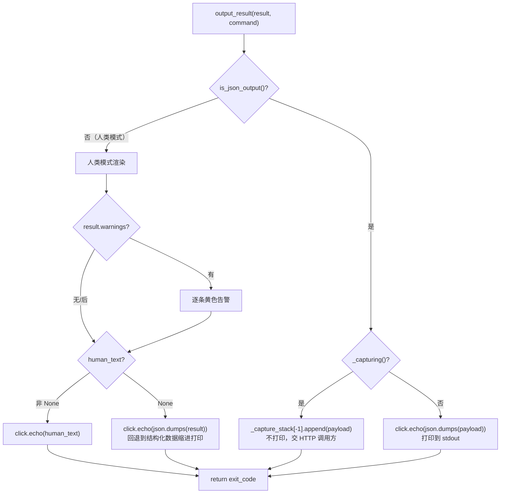
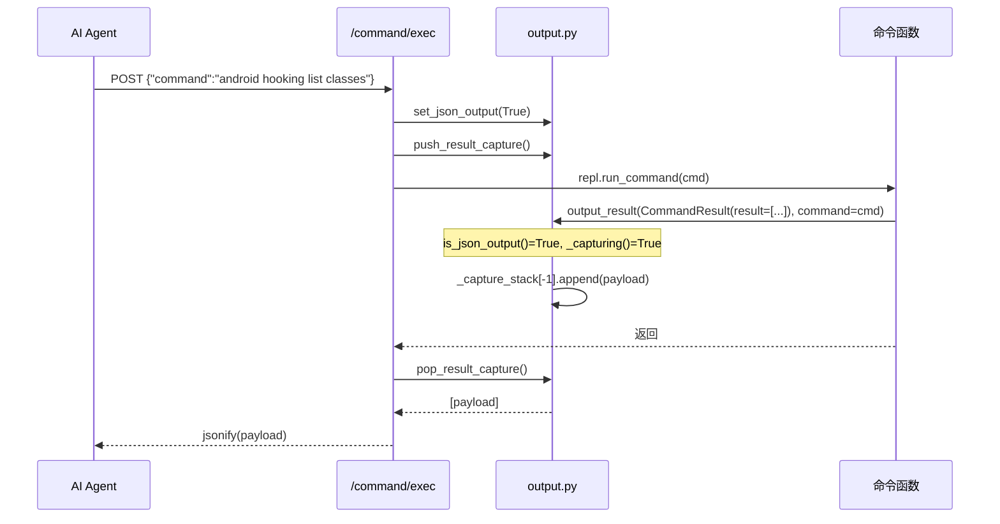

# 统一命令输出层 <code>objection/utils/output.py</code>

objection 的命令输出渲染中枢。引入 `CommandResult` 结构化结果对象，让命令函数「返回数据」而非「直接打印」，再由 `output_result` 根据当前输出模式决定渲染成 JSON（供 AI Agent 解析）还是人类文本（保留原有体验）。这是 objection 面向 Agent 化改造的核心枢纽。

## 📋 模块概览
| 项目 | 值 |
| --- | --- |
| 文件路径 | `objection/utils/output.py` |
| 类型 | 工具（输出渲染 + 结果捕获） |
| 被谁调用 | 改造后的 commands 模块（构造 `CommandResult` 并调 `output_result`）、`api/agent_endpoints.py`（`push/pop_result_capture` 捕获、`set_json_output` 强制 JSON 模式）、`utils/events.py`（`is_json_output` 守门） |
| 依赖 | `json`、`dataclasses`、`click`、`state.app.app_state` |

## 🎯 解决的问题
- **命令输出无法被机器解析**：传统命令直接 `click.secho` 打印人类文本，Agent 无法可靠提取数据。需要一个统一 JSON schema 让每条命令的输出都是结构化的。
- **同一份命令逻辑要同时服务人类与 Agent**：不能为 Agent 写一套独立命令，而要让原命令函数「返回 `CommandResult`」，由渲染层按模式分流。
- **HTTP API 场景不能走 stdout**：`/command/exec` 端点在 Flask 请求上下文里执行命令，命令的 JSON 输出不应打印到 stdout 而要返回给 HTTP 调用方。需要「结果捕获」机制让改造后的命令无需感知调用上下文。
- **异步事件需要流式推送**：Hook 命中是 push 模型，需要单独的 JSON 行事件流通道，与同步命令结果分离。

## 🏗️ 核心结构

### `CommandResult` — 结构化命令结果
源码：[`objection/utils/output.py:80`](https://github.com/android-security-engineer/objection-skills/blob/master/objection/utils/output.py#L80)

```python
@dataclass
class CommandResult:
    result: Any = None
    status: str = 'ok'
    human_text: Optional[str] = None
    jobs_created: list = field(default_factory=list)
    warnings: list = field(default_factory=list)
    exit_code: int = 0

    def to_dict(self, command: str = '') -> dict:
        return {
            'status': self.status,
            'command': command,
            'result': self.result,
            'jobs_created': self.jobs_created,
            'warnings': self.warnings,
        }
```

字段语义：
- `result`：命令的核心结构化输出（list/dict/scalar），是 Agent 真正要解析的数据。
- `status`：`'ok'` 或 `'error'`，Agent 据此分流。
- `human_text`：人类可读文本。为 `None` 时，人类模式回退到 `result` 的 JSON 缩进打印；非 `None` 时人类模式直接打印它，保留原有人性化排版。
- `jobs_created`：本次命令创建的 Job identifier 列表，供 Agent 跟踪后台 Hook 生命周期。
- `warnings`：非致命警告列表，两种模式都会展示。
- `exit_code`：进程退出码，0 成功非 0 失败。

### 统一 JSON Schema
源码：[`objection/utils/output.py:16`](https://github.com/android-security-engineer/objection-skills/blob/master/objection/utils/output.py#L16)（模块 docstring）与 `to_dict` 实现：

```json
{
    "status": "ok" | "error",
    "command": "<触发命令>",
    "result": <任意结构化数据>,
    "jobs_created": [<int>, ...],
    "warnings": ["<str>", ...]
}
```

所有改造后的命令在 JSON 模式下都吐这个 schema，Agent 用同一套解析器处理任意命令的输出。

### `output_result` — 渲染分流
源码：[`objection/utils/output.py:129`](https://github.com/android-security-engineer/objection-skills/blob/master/objection/utils/output.py#L129)

```python
def output_result(result: CommandResult, command: str = '') -> int:
    if is_json_output():
        payload = result.to_dict(command)
        if _capturing():
            _capture_stack[-1].append(payload)
            return result.exit_code
        click.echo(json.dumps(payload, ensure_ascii=False, default=str, indent=2))
        return result.exit_code
    # 人类模式
    if result.warnings:
        for w in result.warnings:
            click.secho('Warning: {0}'.format(w), fg='yellow')
    if result.human_text is not None:
        click.echo(result.human_text)
    elif result.result is not None:
        click.echo(json.dumps(result.result, ensure_ascii=False, default=str, indent=2))
    return result.exit_code
```

这是整个 Agent JSON 化的「渲染分流点」，三条路径：



关键设计：
- **JSON 模式 + 捕获中 → 不打印**：`_capturing()` 为 True 时 payload 进捕获栈顶缓冲区，不碰 stdout。这让 HTTP `/command/exec` 端点能取回命令输出。
- **人类模式回退**：`human_text` 为 None 时用 `json.dumps(result.result, indent=2)` 打印结构化数据，保证未专门写人类文本的命令也有可读输出。
- **`default=str`**：JSON 序列化时对非原生类型（如 `bytes`、自定义对象）用 `str()` 兜底，避免序列化失败。
- **`ensure_ascii=False`**：中文等非 ASCII 字符直接输出，不转义。

### `is_json_output` — 全局 JSON 模式读取
源码：[`objection/utils/output.py:116`](https://github.com/android-security-engineer/objection-skills/blob/master/objection/utils/output.py#L116)

```python
def is_json_output() -> bool:
    return getattr(app_state, 'json_output', False)
```

用 `getattr` 带默认值读取 `app_state.json_output`。该字段由 `set_json_output()` 运行时注入（不在 `AppState.__init__` 显式声明），老代码路径未调用时天然得 `False`，零破坏。

### `should_output_json` — 命令级 JSON 判定
源码：[`objection/utils/output.py:182`](https://github.com/android-security-engineer/objection-skills/blob/master/objection/utils/output.py#L182)

```python
def should_output_json(args: Optional[list] = None) -> bool:
    if is_json_output():
        return True
    if args and '--json' in args:
        return True
    return False
```

与 `is_json_output` 的区别：
- `is_json_output()` 读**全局**开关（`app_state.json_output`），由 `--json` CLI 全局 flag 或 `agent exec` / HTTP 端点的 `set_json_output(True)` 置位。
- `should_output_json(args)` 在此基础上额外检查**命令级** `--json` 参数（`args` 列表里是否含 `'--json'`）。

用途差异：某些命令在 JSON 模式下会跳过人类专用的表格渲染（如彩色表格），用 `should_output_json` 判断是否准备结构化数据；最终渲染统一由 `output_result` 完成。即 `should_output_json` 是「命令内部要不要走结构化分支」，`output_result` 是「最终怎么吐出去」。

### 结果捕获机制 — `_capture_stack`
源码：[`objection/utils/output.py:44`](https://github.com/android-security-engineer/objection-skills/blob/master/objection/utils/output.py#L44)

```python
_capture_stack: list = []

def push_result_capture() -> list:
    buf = []
    _capture_stack.append(buf)
    return buf

def pop_result_capture() -> Optional[list]:
    if not _capture_stack:
        return None
    return _capture_stack.pop()

def _capturing() -> bool:
    return bool(_capture_stack)
```

用栈而非单变量，是为了支持嵌套场景（一个命令内部又触发另一个走 `output_result` 的命令）。`api/agent_endpoints.py` 的 `/command/exec` 是主要消费者：

```python
buf = push_result_capture()
try:
    repl.run_command(cmd)
except Exception as e:
    output_result(CommandResult(result={'error': str(e)}, status='error', ...), command=cmd)
captured = pop_result_capture() or []
```

命令执行期间所有 `output_result` 调用的 payload 都进 `buf`，HTTP 端点取出后 jsonify 返回。这让**已改造走 `output_result` 的命令无需任何改动即可同时服务 CLI stdout 与 HTTP API**。

### `error_result` — 错误快捷构造
源码：[`objection/utils/output.py:164`](https://github.com/android-security-engineer/objection-skills/blob/master/objection/utils/output.py#L164)

```python
def error_result(message: str, command: str = '', exit_code: int = 1) -> CommandResult:
    return CommandResult(
        result={'error': message},
        status='error',
        human_text=message,
        exit_code=exit_code,
    )
```

`result` 设为 `{'error': message}`，`human_text` 同步设为 message，这样 JSON 模式与人类模式都得到一致错误信息。

### `emit_event` — 异步事件流
源码：[`objection/utils/output.py:203`](https://github.com/android-security-engineer/objection-skills/blob/master/objection/utils/output.py#L203)

```python
def emit_event(event_type: str, data: Any = None) -> None:
    if not is_json_output():
        return
    event = {'event': event_type, 'data': data}
    click.echo(json.dumps(event, ensure_ascii=False, default=str), flush=True)
```

与 `output_result` 的同步命令结果不同，`emit_event` 用于 Hook 命中、Job 注册等异步推送。JSON 模式下每行一个事件 JSON（`flush=True` 立即刷出），Agent 可按行流式解析；人类模式直接 return（由 agent 侧 `send()` 处理）。

> 注：`emit_event` 写 stdout 与 `events.py` 的事件队列是两条并行的 Agent 异步通道。前者适合「Agent 跟随 stdout 流」的场景，后者适合「Agent HTTP 轮询」的场景。

### `set_json_output` — 全局开关写入
源码：[`objection/utils/output.py:226`](https://github.com/android-security-engineer/objection-skills/blob/master/objection/utils/output.py#L226)

```python
def set_json_output(enabled: bool) -> None:
    app_state.json_output = enabled
```

由 `console/cli.py`（`--json` 全局 flag）、`api/agent_endpoints.py`（`_ensure_json_mode`）调用，是 Agent JSON 化的总开关。



## ⚙️ 实现要点
- **「返回数据」而非「直接打印」**：传统 objection 命令直接 `click.secho`，Agent 无法解析。改造后命令构造 `CommandResult` 返回，由 `output_result` 统一渲染——这是 Agent JSON 化的根本范式转变。
- **双模式无损共存**：`human_text` 字段让命令可以同时提供「人类优雅排版」与「机器结构化数据」，二者独立，互不污染。未改造的命令（仍直接打印）在捕获模式下会得到一条 `command produced no structured output` 警告，Agent 据此知道该命令尚未 Agent 化。
- **结果捕获栈支持嵌套**：用 `_capture_stack` 而非单变量，一个命令内部触发另一个走 `output_result` 的命令时，payload 进栈顶缓冲区，不会污染外层捕获。
- **`json_output` 字段动态注入**：刻意不在 `AppState.__init__` 加该字段，由 `set_json_output` 运行时 `setattr` 注入，`is_json_output` 用 `getattr` 带默认值读取——老代码路径零破坏。
- **`default=str` + `ensure_ascii=False`**：序列化兜底策略，避免非原生类型报错、避免中文转义。
- **同步结果与异步事件分离**：`output_result` 走统一 schema（含 `command` 字段），`emit_event` 走 `{event, data}` schema（无 `command`），Agent 据字段区分「命令回复」与「异步推送」。
- **HTTP 端点强制 JSON 模式**：`_ensure_json_mode()` 在每个 agent 端点入口调 `set_json_output(True)`，保证即便 CLI 启动时未带 `--json`，HTTP 调用也始终拿到 JSON。

## 🔍 源码索引
| 符号 | 位置 |
| --- | --- |
| `_capture_stack` | [`objection/utils/output.py:44`](https://github.com/android-security-engineer/objection-skills/blob/master/objection/utils/output.py#L44) |
| `push_result_capture` | [`objection/utils/output.py:47`](https://github.com/android-security-engineer/objection-skills/blob/master/objection/utils/output.py#L47) |
| `pop_result_capture` | [`objection/utils/output.py:62`](https://github.com/android-security-engineer/objection-skills/blob/master/objection/utils/output.py#L62) |
| `_capturing` | [`objection/utils/output.py:74`](https://github.com/android-security-engineer/objection-skills/blob/master/objection/utils/output.py#L74) |
| `CommandResult` | [`objection/utils/output.py:80`](https://github.com/android-security-engineer/objection-skills/blob/master/objection/utils/output.py#L80) |
| `CommandResult.to_dict` | [`objection/utils/output.py:104`](https://github.com/android-security-engineer/objection-skills/blob/master/objection/utils/output.py#L104) |
| `is_json_output` | [`objection/utils/output.py:116`](https://github.com/android-security-engineer/objection-skills/blob/master/objection/utils/output.py#L116) |
| `output_result` | [`objection/utils/output.py:129`](https://github.com/android-security-engineer/objection-skills/blob/master/objection/utils/output.py#L129) |
| `error_result` | [`objection/utils/output.py:164`](https://github.com/android-security-engineer/objection-skills/blob/master/objection/utils/output.py#L164) |
| `should_output_json` | [`objection/utils/output.py:182`](https://github.com/android-security-engineer/objection-skills/blob/master/objection/utils/output.py#L182) |
| `emit_event` | [`objection/utils/output.py:203`](https://github.com/android-security-engineer/objection-skills/blob/master/objection/utils/output.py#L203) |
| `set_json_output` | [`objection/utils/output.py:226`](https://github.com/android-security-engineer/objection-skills/blob/master/objection/utils/output.py#L226) |

## 🔗 相关文档
- [整体架构](/guide/architecture)
- [RPC 通信机制](/guide/rpc)
- [面向 AI Agent 使用](/guide/agent-usage)
- [HTTP API 端点](/guide/agent-http)
