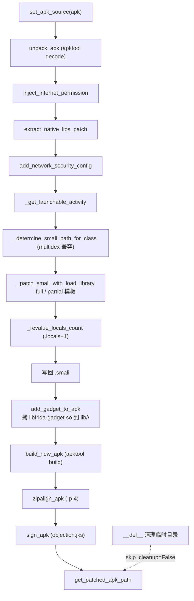

# Android APK Patcher <code>objection/utils/patchers/android.py</code>

实现无 root 场景下给 Android APK 注入 Frida Gadget 的完整流程：下载对应架构的 gadget `.so`、解压 APK、改 manifest（加 INTERNET 权限、开 `extractNativeLibs`、加网络安全配置）、往启动 Activity 的 smali 注入 `System.loadLibrary("frida-gadget")`、把 gadget 拷进 `lib/<arch>/`、回编译 + zipalign + 签名。

## 📋 模块概览
| 项目 | 值 |
| --- | --- |
| 文件路径 | `objection/utils/patchers/android.py` |
| 类型 | 工具（APK 重打包） |
| 被谁调用 | `objection/commands/android/generate.py`（`objection patchapk` 命令入口） |
| 依赖 | `delegator`、`semver`、`requests`、`lzma`、`xml.etree.ElementTree`、`click`、`shutil`/`tempfile`、`re`、`.base`、`.github`、`..helpers.debug_print` |

## 🎯 解决的问题
- **无 root 注入 Frida**：root 设备可直接 `frida-server`，无 root 设备只能把 `frida-gadget` 作为共享库塞进 APK，靠应用启动时 `loadLibrary` 拉起。
- **多 ABI 适配**：APK 可能含 `armeabi-v7a`/`arm64-v8a`/`x86`/`x86_64` 多套 `lib/`，必须按目标架构下载匹配的 gadget。
- **manifest 三件套改造**：注入 gadget 需要应用有 INTERNET 权限（gadget 要回连）、`extractNativeLibs=true`（让系统把 `.so` 解到磁盘供 `dlopen`）、可选的 `network_security_config`（绕 Android 7+ 明文流量限制）。
- **smali 改造的鲁棒性**：启动 Activity 可能有也可能没有 `<clinit>` 静态构造器，注入点要同时处理「已有构造器」和「全新构造器」两种情况，且要修正 `.locals` 寄存器计数。
- **多 dex 处理**：multidex APK 的启动类可能在 `smali_classes2/3/...`，要遍历查找。
- **外部工具链依赖**：`aapt`/`apktool`/`zipalign`/`apksigner`/`adb` 缺一不可，且 apktool 版本要 >= 2.6.0。

## 🏗️ 核心结构

### `AndroidGadget` — Android gadget 下载/管理
源码：`objection/utils/patchers/android.py:19`

继承 `BasePlatformGadget`。核心是架构映射表和下载流程。

### `AndroidGadget.architectures` — ABI 映射表
源码：`objection/utils/patchers/android.py:27`

```python
architectures = {
    'armeabi': 'arm',
    'armeabi-v7a': 'arm',
    'arm64': 'arm64',
    'arm64-v8a': 'arm64',
    'x86': 'x86',
    'x86_64': 'x86_64',
}
```

键是 Android ABI 名（APK 的 `lib/` 子目录名），值是 Frida gadget 的 arch 命名。`armeabi`/`armeabi-v7a` 都映射到 `arm`，`arm64`/`arm64-v8a` 都映射到 `arm64`——Frida 不区分 v7a 与 v1，统一用 `arm`。

### `AndroidGadget._get_download_url` — 从 assets 里挑 URL
源码：`objection/utils/patchers/android.py:131`

```python
def _get_download_url(self) -> str:
    url = ''
    url_start = 'frida-gadget-'
    url_end = 'android-' + self.architectures[self.architecture] + '.so.xz'

    for asset in self.github.get_assets():
        if asset['name'].startswith(url_start) and asset['name'].endswith(url_end):
            url = asset['browser_download_url']

    if not url:
        click.secho('Unable to determine URL to download the library', fg='red')
        raise Exception('Unable to determine URL for Android gadget download.')

    return url
```

匹配规则：asset 名以 `frida-gadget-` 开头、以 `android-<arch>.so.xz` 结尾。如 `frida-gadget-16.7.19-android-arm64.so.xz`。`.xz` 是压缩格式，`download()` 流式存盘后 `unpack()` 用 `lzma` 解压。

### `AndroidPatcher` — APK 改造器
源码：`objection/utils/patchers/android.py:182`

继承 `BasePlatformPatcher`。`required_commands` 声明 5 个外部依赖（`aapt`/`adb`/`apksigner`/`apktool`/`zipalign`）。构造时建临时目录、绑定 objection 自带 keystore 与 network_security_config 资产。

### `AndroidPatcher.required_commands` — 外部工具依赖
源码：`objection/utils/patchers/android.py:185`

```python
required_commands = {
    'aapt':       {'installation': 'apt install aapt (Kali Linux)'},
    'adb':        {'installation': 'apt install adb (Kali Linux); brew install adb (macOS)'},
    'apksigner':  {'installation': 'apt install apksigner (Kali Linux)'},
    'apktool':    {'installation': 'Install from https://apktool.org/docs/install'},
    'zipalign':   {'installation': 'apt install zipalign (Kali Linux)'},
}
```

基类 `_check_commands` 会用 `shutil.which` 探测每个命令，找不到时按 `installation` 文案提示用户安装。

### `AndroidPatcher.is_apktool_ready` — apktool 版本校验
源码：`objection/utils/patchers/android.py:220`

```python
def is_apktool_ready(self) -> bool:
    min_version = '2.6.0'
    o = delegator.run(self.list2cmdline([
        self.required_commands['apktool']['location'],
        '-version',
    ]), timeout=self.command_run_timeout).out.strip()

    if len(o.split('\n')) > 1:
        o = o.split('\n')[0]
    if len(o.split(' ')) > 1:
        o = o.split(' ')[1]
    if len(o) == 0:
        click.secho('Unable to determine apktool version. Is it installed')
        return False

    if semver.compare(o, min_version) < 0:
        click.secho('apktool version should be at least ' + min_version, fg='red', bold=True)
        return False

    # run clean-frameworks-dir
    delegator.run([..., 'empty-framework-dir'], ...)
    return True
```

三重容错解析 apktool 版本号：取首行（Windows 的「Press any key」尾巴）、再取空格分隔第二段（`apktool v 2.x` 类输出）。用 `semver.compare` 比 `2.6.0`，低于则拒绝。最后跑一次 `empty-frameworks-dir` 清理框架缓存（避免旧 framework 污染本次 decode）。

### `AndroidPatcher._get_launchable_activity` — 定位启动 Activity
源码：`objection/utils/patchers/android.py:328`

```python
def _get_launchable_activity(self) -> str:
    activities = (match.groups()[0] for match in
                  re.finditer(r"^launchable-activity: name='([^']+)'", self._get_appt_output(), re.MULTILINE))
    activity = next(activities, None)

    if activity is not None:
        return activity

    # fallback: 手动解析 AndroidManifest 的 activity-alias
    manifest = self._get_android_manifest()
    root = manifest.getroot()
    for alias in root.findall('./application/activity-alias'):
        current_activity = alias.get('{...}targetActivity')
        categories = alias.findall('./intent-filter/category')
        for category in categories:
            category_name = category.get('{...}name')
            if category_name == 'android.intent.category.LAUNCHER':
                return current_activity

    raise Exception('Unable to determine launchable activity')
```

两级回退：先 `aapt dump badging` 正则匹配 `launchable-activity: name='...'`；aapt 拿不到（如 `activity-alias` 启动）则手动解析 manifest 找带 `LAUNCHER` category 的 `activity-alias`，取其 `targetActivity`。

### `AndroidPatcher._patch_smali_with_load_library` — smali 注入核心
源码：`objection/utils/patchers/android.py:704`

按启动类是否已有 `<clinit>` 选两种注入模板：

```python
# 无构造器：注入全新 <clinit>
full_load_library = ('.method static constructor <clinit>()V\n'
                     '   .locals 0\n'
                     '   .prologue\n'
                     '   const-string v0, "frida-gadget"\n'
                     '   invoke-static {v0}, Ljava/lang/System;->loadLibrary(Ljava/lang/String;)V\n'
                     '   return-void\n'
                     '.end method\n')

# 已有构造器：在方法体首行注入 loadLibrary
partial_load_library = ('\n    const-string v0, "frida-gadget"\n'
                        '    invoke-static {v0}, Ljava/lang/System;->loadLibrary(Ljava/lang/String;)V\n')

if 'clinit' in smali_lines[inject_marker]:
    inject_point = self._determine_first_inject_point_of_smali_method_from_line(smali_lines, inject_marker)
    patched_smali = smali_lines[:inject_point] + partial_load_library.splitlines(keepends=True) + smali_lines[inject_point:]
else:
    patched_smali = smali_lines[:inject_marker] + full_load_library.splitlines(keepends=True) + smali_lines[inject_marker:]
```

两种模板都加载名为 `frida-gadget` 的共享库（对应 `libfrida-gadget.so`）。`full` 版自成完整方法，`partial` 版只插两行寄存器指令，落在已有方法体开头（`.locals`/annotation 之后）。

### `AndroidPatcher._revalue_locals_count` — 修正寄存器计数
源码：`objection/utils/patchers/android.py:760`

`partial_load_library` 用了 `v0` 寄存器，若原方法 `.locals 0` 会寄存器不足导致验证失败。本方法找到注入所在方法的第一个 `.locals N`，把 `N` 加 1：

```python
defined_locals = [i for i, x in enumerate(patched_smali[inject_marker:end_of_method])
                  if '.locals' in x]
# ...
new_locals_value = defined_local_value_as_int + 1
patched_smali[locals_smali_offset] = patched_smali[locals_smali_offset].replace(
    str(defined_local_value_as_int), str(new_locals_value))
```

失败只警告不中断（很多时候 `.locals` 不准也不致命，`--pause` 可手动修）。

### `AndroidPatcher.inject_load_library` — 注入主流程
源码：`objection/utils/patchers/android.py:816`

定位 smali 文件 → 读行 → 找 `# direct methods` 注入点 → `_patch_smali_with_load_library` → `_revalue_locals_count` → 写回。注入点选 `# direct methods` 注释下一行，确保注入的静态构造器落在直接方法区。

### `AndroidPatcher._determine_smali_path_for_class` — 多 dex 查找
源码：`objection/utils/patchers/android.py:586`

先查 `smali/<class>.smali`，找不到则遍历 `smali_classes2`~`smali_classes99`（multidex）。找不到抛 `Unable to find smali to patch!`。

### manifest 三件套改造
- `inject_internet_permission`（`android.py:429`）：检查 aapt 输出是否已有 INTERNET，没有则向 manifest 追加 `<uses-permission>`。
- `extract_native_libs_patch`（`android.py:463`）：把 `android:extractNativeLibs="false"` 改 `true`——AndroidStudio 2.1+ 默认 false，会导致 gadget `.so` 不被解出，`loadLibrary` 失败。
- `add_network_security_config`（`android.py:531`）：拷 objection 自带的 `network_security_config.xml` 到 `res/xml/`，并在 manifest `application` 标签加 `android:networkSecurityConfig="@xml/network_security_config"` 引用，绕 Android 7+ 明文流量限制。
- `flip_debug_flag_to_true`（`android.py:496`）：可选，把 `android:debuggable` 设 true。

### 回编译 + 对齐 + 签名
- `build_new_apk`（`android.py:892`）：`apktool build`，可选 `--use-aapt2`。
- `zipalign_apk`（`android.py:918`）：`zipalign -p 4` 4 字节对齐（`-p` 对齐 `.so` 4K 页边界，配合 `extractNativeLibs`）。
- `sign_apk`（`android.py:942`）：用 objection 自带 keystore（`assets/objection.jks`，密码 `basil-joule-bug`，alias `objection`）调 `apksigner sign`。



## ⚙️ 实现要点
- **`full` vs `partial` 注入模板的取舍**：`full` 注入全新 `<clinit>`，干净但要确保类没有别的静态初始化逻辑冲突；`partial` 在已有 `<clinit>` 体首行插指令，复用现有方法框架，但必须改 `.locals`。选择依据是 `inject_marker` 那一行是否含 `clinit`——`apktool` 反编译的 `# direct methods` 注释后第一个方法若是 `<clinit>` 就走 partial，否则 full。
- **`.locals` 修正用字符串 replace 而非解析**：`patched_smali[offset].replace(str(old), str(new))` 会替换该行所有匹配——若 `.locals 1` 那行恰好有别的 `1`（如注释行号），会误伤。实际 `.locals N` 行通常只有这一个数字，风险低，但这是已知脆弱点。
- **`extractNativeLibs` 是 Android 6+ 的关键坑**：`loadLibrary` 要求 `.so` 在文件系统上可见，`extractNativeLibs=false` 时 `.so` 直接从 APK 读取（不解压），`dlopen` 失败。objection 强制改 true 保证 gadget 可加载。
- **自带 keystore 简化签名**：用固定 `objection.jks` + 公开密码 `basil-joule-bug`，让无签名环境的用户也能装。代价是 patched APK 与 objection 共用签名，不适用于生产分发（仅测试）。
- **`__del__` 清理依赖 GC 时机**：临时目录删在 `__del__`，Python GC 时机不确定；`--skip-cleanup` 可保留临时目录供调试。若进程异常退出，临时文件可能残留——`tempfile.mkdtemp(suffix='.apktemp')` 至少把它们集中到系统 temp 区。
- **`aapt dump badging` 输出作缓存**：`_get_appt_output` 把 aapt 输出存到 `self.aapt`，`inject_internet_permission` 和 `_get_launchable_activity` 都复用，避免重复跑 aapt。
- **`is_apktool_ready` 的三重解析**：apktool 不同版本/平台的 `-version` 输出格式不一（有的带「Press any key」、有的 `apktool v 2.x`），三段 split 容错是经验积累。

## 🔍 源码索引
| 符号 | 位置 |
| --- | --- |
| `AndroidGadget` | `objection/utils/patchers/android.py:19` |
| `AndroidGadget.architectures` | `objection/utils/patchers/android.py:27` |
| `AndroidGadget.get_frida_library_path` | `objection/utils/patchers/android.py:81` |
| `AndroidGadget.download` | `objection/utils/patchers/android.py:107` |
| `AndroidGadget._get_download_url` | `objection/utils/patchers/android.py:131` |
| `AndroidGadget.unpack` | `objection/utils/patchers/android.py:155` |
| `AndroidPatcher` | `objection/utils/patchers/android.py:182` |
| `AndroidPatcher.required_commands` | `objection/utils/patchers/android.py:185` |
| `AndroidPatcher.is_apktool_ready` | `objection/utils/patchers/android.py:220` |
| `AndroidPatcher._get_android_manifest` | `objection/utils/patchers/android.py:285` |
| `AndroidPatcher._get_appt_output` | `objection/utils/patchers/android.py:305` |
| `AndroidPatcher._get_launchable_activity` | `objection/utils/patchers/android.py:328` |
| `AndroidPatcher.unpack_apk` | `objection/utils/patchers/android.py:400` |
| `AndroidPatcher.inject_internet_permission` | `objection/utils/patchers/android.py:429` |
| `AndroidPatcher.extract_native_libs_patch` | `objection/utils/patchers/android.py:463` |
| `AndroidPatcher.flip_debug_flag_to_true` | `objection/utils/patchers/android.py:496` |
| `AndroidPatcher.add_network_security_config` | `objection/utils/patchers/android.py:531` |
| `AndroidPatcher._determine_smali_path_for_class` | `objection/utils/patchers/android.py:586` |
| `AndroidPatcher._determine_end_of_smali_method_from_line` | `objection/utils/patchers/android.py:630` |
| `AndroidPatcher._determine_first_inject_point_of_smali_method_from_line` | `objection/utils/patchers/android.py:665` |
| `AndroidPatcher._patch_smali_with_load_library` | `objection/utils/patchers/android.py:704` |
| `AndroidPatcher._revalue_locals_count` | `objection/utils/patchers/android.py:760` |
| `AndroidPatcher.inject_load_library` | `objection/utils/patchers/android.py:816` |
| `AndroidPatcher.add_gadget_to_apk` | `objection/utils/patchers/android.py:867` |
| `AndroidPatcher.build_new_apk` | `objection/utils/patchers/android.py:892` |
| `AndroidPatcher.zipalign_apk` | `objection/utils/patchers/android.py:918` |
| `AndroidPatcher.sign_apk` | `objection/utils/patchers/android.py:942` |
| `AndroidPatcher.__del__` | `objection/utils/patchers/android.py:974` |

## 🔗 相关文档
- [整体架构](/guide/architecture)
- [APK Patch（功能详解）](/features/patcher)
- [Patcher 基类](/reference/utils/patchers/base)
- [GitHub Gadget 下载](/reference/utils/patchers/github)
- [iOS Patcher](/reference/utils/patchers/ios)
