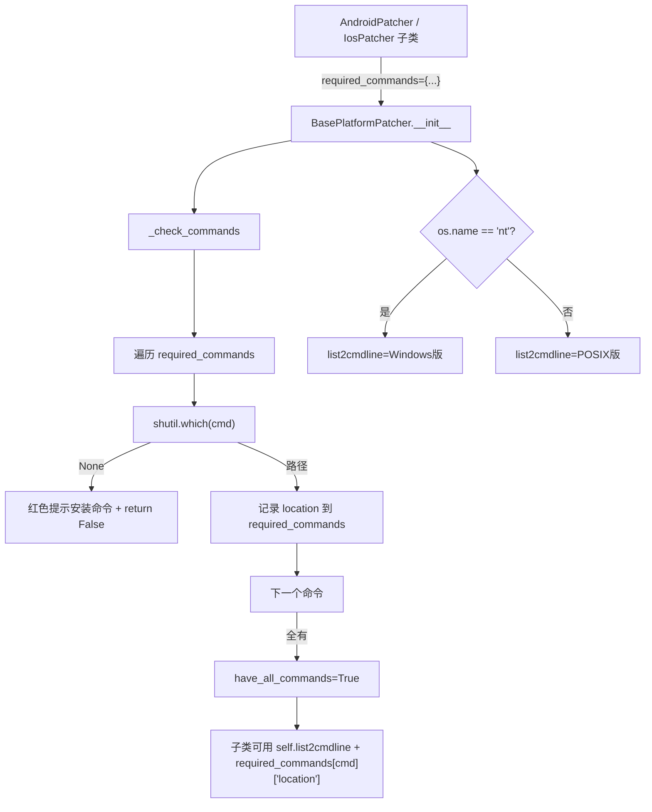

# Patcher 基类 <code>objection/utils/patchers/base.py</code>

定义 Android/iOS patcher 共用的基类与工具：`BasePlatformGadget`（gadget 下载/版本管理的基类）和 `BasePlatformPatcher`（patcher 命令依赖检查与命令行构造的基类）。同时定义 `~/.objection` 路径常量和 POSIX 命令行拼接函数。

## 📋 模块概览
| 项目 | 值 |
| --- | --- |
| 文件路径 | `objection/utils/patchers/base.py` |
| 类型 | 工具（patcher 公共基类） |
| 被谁调用 | `objection/utils/patchers/android.py`（`AndroidGadget`、`AndroidPatcher` 继承）、`objection/utils/patchers/ios.py`（`IosGadget`、`IosPatcher` 继承） |
| 依赖 | `os`、`shlex`、`shutil`、`subprocess.list2cmdline`、`click`、`json`、`.github.Github` |

## 🎯 解决的问题
- **gadget 版本追踪**：Frida Gadget 下载后要记录本地已下载版本，避免重复下载。基类提供 `get_local_version`/`set_local_version`，子类只需指定 `gadget_type`。
- **外部命令依赖检查**：patcher 重度依赖 `aapt`/`apktool`/`xcodebuild` 等外部二进制，缺一不可。基类在构造时统一 `shutil.which` 探测并记录路径。
- **跨平台命令行拼接**：Windows 用 `subprocess.list2cmdline`，POSIX 用 `shlex.quote`——两者语义不同，基类按 `os.name` 自动选择。
- **统一的命令超时**：所有外部命令调用共享 `command_run_timeout = 5 分钟`，避免卡死。

## 🏗️ 核心结构

### 模块级路径常量与 `list2posix_cmdline`
源码：[`objection/utils/patchers/base.py:12`](https://github.com/android-security-engineer/objection-skills/blob/master/objection/utils/patchers/base.py#L12)

```python
objection_path = os.path.join(os.path.expanduser('~'), '.objection')
gadget_versions = os.path.join(objection_path, 'gadget_versions')


def list2posix_cmdline(seq):
    return ' '.join(map(shlex.quote, seq))
```

- `objection_path`：`~/.objection`，所有 patcher 产物的根目录。
- `gadget_versions`：`~/.objection/gadget_versions`，一个 JSON 文件记录各 gadget 类型的本地版本。
- `list2posix_cmdline`：POSIX 下的命令行拼接，用 `shlex.quote` 转义每个参数——`subprocess.list2cmdline` 是 Windows 语义，POSIX 下会错误转义。

### `BasePlatformGadget` — gadget 下载/版本基类
源码：[`objection/utils/patchers/base.py:28`](https://github.com/android-security-engineer/objection-skills/blob/master/objection/utils/patchers/base.py#L28)

```python
class BasePlatformGadget(object):
    """ Class with base methods for any platforms Gadget downloaded """

    def __init__(self, github: Github) -> None:
        self.github = github
```

构造时持有 `Github` 实例（用于查 release assets）。两个版本管理方法：

### `BasePlatformGadget.get_local_version` — 读本地版本
源码：[`objection/utils/patchers/base.py:40`](https://github.com/android-security-engineer/objection-skills/blob/master/objection/utils/patchers/base.py#L40)

```python
@staticmethod
def get_local_version(gadget_type: str) -> str:
    if not os.path.exists(gadget_versions):
        return '0'

    with open(gadget_versions, 'r') as f:
        versions = f.read()

    try:
        versions = json.loads(versions)
    except json.decoder.JSONDecodeError:
        return '0'

    if gadget_type in versions:
        return versions[gadget_type]

    return '0'
```

`@staticmethod` 说明它不依赖实例状态——任意地方都能查。返回 `'0'` 作为「未安装」哨兵值（版本号字符串不会是单字符 `0`，便于上层 `Version(local) < Version(remote)` 比较）。三类失败都返回 `'0'`：文件不存在、JSON 损坏、类型未记录。

### `BasePlatformGadget.set_local_version` — 写本地版本
源码：[`objection/utils/patchers/base.py:68`](https://github.com/android-security-engineer/objection-skills/blob/master/objection/utils/patchers/base.py#L68)

读改写 `gadget_versions` JSON：先读现有字典（文件损坏则置空 `{}`），加新键，整体 dump 回去。返回 `self` 支持链式调用。

### `BasePlatformPatcher` — patcher 命令基类
源码：[`objection/utils/patchers/base.py:104`](https://github.com/android-security-engineer/objection-skills/blob/master/objection/utils/patchers/base.py#L104)

```python
class BasePlatformPatcher(object):
    required_commands = {}

    def __init__(self):
        self.have_all_commands = self._check_commands()
        self.command_run_timeout = 60 * 5

        if os.name == 'nt':
            self.list2cmdline = list2cmdline
        else:
            self.list2cmdline = list2posix_cmdline
```

- `required_commands`：子类填的字典，键是命令名，值含 `installation` 提示文案。
- `have_all_commands`：构造时一次性探测，后续 `are_requirements_met()` 直接返回这个布尔值。
- `list2cmdline`：按操作系统绑定为 Windows 版或 POSIX 版，子类调 `self.list2cmdline(...)` 拼命令行。

### `BasePlatformPatcher._check_commands` — 探测依赖
源码：[`objection/utils/patchers/base.py:121`](https://github.com/android-security-engineer/objection-skills/blob/master/objection/utils/patchers/base.py#L121)

```python
def _check_commands(self) -> bool:
    for cmd, attributes in self.required_commands.items():
        location = shutil.which(cmd)

        if location is None:
            click.secho('Unable to find {0}. Install it with: {1} before continuing.'.format(
                cmd, attributes['installation']), fg='red', bold=True)
            return False

        self.required_commands[cmd]['location'] = location

    return True
```

用 `shutil.which` 找命令路径，找不到就红色打印安装提示并返回 False（整体失败）。找到则把绝对路径写回 `required_commands[cmd]['location']`——子类后续调命令时直接取这个 location，避免再查 PATH。



## ⚙️ 实现要点
- **`required_commands` 既当声明又当状态**：子类在类体里声明它（含 `installation` 提示），`_check_commands` 运行时往同一个字典里塞 `location`。这让声明和运行时状态共享一个数据结构，子类调用时 `self.required_commands['apktool']['location']` 一行取到已解析路径。
- **`'0'` 作为版本哨兵**：用字符串 `'0'` 而非 `None` 表示「未安装」，因为上层做 `semver.compare(local, remote)` 或 `Version(local) < Version(remote)` 时 `'0'` 天然小于任何真实版本号，无需特判。但前提是真实版本号不会是 `0`——Frida 从未发过 `0.x` 以下的 tag。
- **`command_run_timeout = 300`**：5 分钟对 `apktool build` 大型 APK 可能偏紧，但足以挡住无限挂起；超时由 `delegator.run(..., timeout=...)` 在子类里传递。
- **`list2posix_cmdline` 用 `shlex.quote` 而非 `list2cmdline`**：Python 标准库的 `subprocess.list2cmdline` 是 Windows quoting 语义（双引号 + 反斜杠转义），在 POSIX shell 里会出错。这里显式用 `shlex.quote` 包每个参数，保证含空格/特殊字符的路径（如 `/tmp/My App.apktemp`）正确转义。
- **gadget 版本文件是共享 JSON**：`gadget_versions` 一个文件存所有平台版本（android 各架构、ios），用 `gadget_type` 区分键——一次下载只更新自己那个键，不影响其他平台记录。

## 🔍 源码索引
| 符号 | 位置 |
| --- | --- |
| `objection_path` | [`objection/utils/patchers/base.py:12`](https://github.com/android-security-engineer/objection-skills/blob/master/objection/utils/patchers/base.py#L12) |
| `gadget_versions` | [`objection/utils/patchers/base.py:13`](https://github.com/android-security-engineer/objection-skills/blob/master/objection/utils/patchers/base.py#L13) |
| `list2posix_cmdline` | [`objection/utils/patchers/base.py:16`](https://github.com/android-security-engineer/objection-skills/blob/master/objection/utils/patchers/base.py#L16) |
| `BasePlatformGadget` | [`objection/utils/patchers/base.py:28`](https://github.com/android-security-engineer/objection-skills/blob/master/objection/utils/patchers/base.py#L28) |
| `BasePlatformGadget.get_local_version` | [`objection/utils/patchers/base.py:40`](https://github.com/android-security-engineer/objection-skills/blob/master/objection/utils/patchers/base.py#L40) |
| `BasePlatformGadget.set_local_version` | [`objection/utils/patchers/base.py:68`](https://github.com/android-security-engineer/objection-skills/blob/master/objection/utils/patchers/base.py#L68) |
| `BasePlatformPatcher` | [`objection/utils/patchers/base.py:104`](https://github.com/android-security-engineer/objection-skills/blob/master/objection/utils/patchers/base.py#L104) |
| `BasePlatformPatcher._check_commands` | [`objection/utils/patchers/base.py:121`](https://github.com/android-security-engineer/objection-skills/blob/master/objection/utils/patchers/base.py#L121) |
| `BasePlatformPatcher.are_requirements_met` | [`objection/utils/patchers/base.py:143`](https://github.com/android-security-engineer/objection-skills/blob/master/objection/utils/patchers/base.py#L143) |

## 🔗 相关文档
- [整体架构](/guide/architecture)
- [APK Patch（功能详解）](/features/patcher)
- [Android Patcher](/reference/utils/patchers/android)
- [iOS Patcher](/reference/utils/patchers/ios)
- [GitHub Gadget 下载](/reference/utils/patchers/github)
