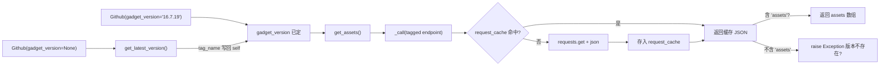

# GitHub Gadget 下载器 <code>objection/utils/patchers/github.py</code>

封装与 Frida 的 GitHub Releases 交互：查询最新版本号、按版本拉取 release assets 列表。带进程内请求缓存，避免同一 endpoint 被重复请求（Android 各架构 patcher 会各调一次 `get_assets`）。

## 📋 模块概览
| 项目 | 值 |
| --- | --- |
| 文件路径 | `objection/utils/patchers/github.py` |
| 类型 | 工具（GitHub API 客户端） |
| 被谁调用 | `objection/utils/patchers/android.py`（`AndroidGadget` 持有 `Github` 实例）、`objection/utils/patchers/ios.py`（`IosGadget` 持有） |
| 依赖 | `requests` |

## 🎯 解决的问题
- **统一 Frida release 端点**：Frida 的 gadget 二进制发布在 `github.com/frida/frida` 的 releases。本类封装 latest 与 tag 两种查询端点，避免散落在各 patcher 里。
- **避免重复网络请求**：一次 patch 流程里，Android 多架构会多次调 `get_assets`，但指向同一 tag endpoint——进程内字典缓存让第二次起命中缓存。
- **显式版本控制**：支持「用最新版」或「指定版本」两种模式，由构造参数 `gadget_version` 决定。
- **assets 缺失时给清晰错误**：tag 写错或版本不存在时，GitHub 返回的 JSON 不含 `assets` 键，本类抛异常并提示「确认版本是否存在于 GitHub」。

## 🏗️ 核心结构

### `Github` 类与端点常量
源码：[`objection/utils/patchers/github.py:4`](https://github.com/android-security-engineer/objection-skills/blob/master/objection/utils/patchers/github.py#L4)

```python
class Github(object):
    """ Interact with Github """

    GITHUB_LATEST_RELEASE = 'https://api.github.com/repos/frida/frida/releases/latest'
    GITHUB_TAGGED_RELEASE = 'https://api.github.com/repos/frida/frida/releases/tags/{tag}'

    gadget_version = None

    def __init__(self, gadget_version: str = None):
        if gadget_version:
            self.gadget_version = gadget_version

        self.request_cache = {}
```

- 两个类常量：`GITHUB_LATEST_RELEASE` 查最新 release，`GITHUB_TAGGED_RELEASE` 按 tag 查指定版本（`{tag}` 占位符）。
- `gadget_version`：实例上下文，None 表示「尚未确定版本」，由 `get_latest_version()` 填充或构造时显式传入。
- `request_cache`：实例级字典，key 是 endpoint URL，value 是 `requests.get().json()` 结果。

### `_call` — 带缓存的请求
源码：[`objection/utils/patchers/github.py:23`](https://github.com/android-security-engineer/objection-skills/blob/master/objection/utils/patchers/github.py#L23)

```python
def _call(self, endpoint: str) -> dict:
    # return a cached response if possible
    if endpoint in self.request_cache:
        return self.request_cache[endpoint]

    # get a new response
    results = requests.get(endpoint).json()

    # cache it
    self.request_cache[endpoint] = results

    # and return it
    return results
```

三步：查缓存 → 发请求 → 存缓存并返回。缓存粒度是完整 endpoint URL 字符串，所以 latest 和某 tag 各占一个缓存槽。

### `get_latest_version` — 取最新版本号
源码：[`objection/utils/patchers/github.py:44`](https://github.com/android-security-engineer/objection-skills/blob/master/objection/utils/patchers/github.py#L44)

```python
def get_latest_version(self) -> str:
    self.gadget_version = self._call(self.GITHUB_LATEST_RELEASE)['tag_name']
    return self.gadget_version
```

调 latest endpoint，取 `tag_name`（如 `16.7.19`），同时把它存到 `self.gadget_version`——这样后续 `get_assets` 就能按这个 tag 去查 assets。副作用明显：调用一次后实例「锁定」到最新版。

### `get_assets` — 取某版本的 assets 列表
源码：[`objection/utils/patchers/github.py:56`](https://github.com/android-security-engineer/objection-skills/blob/master/objection/utils/patchers/github.py#L56)

```python
def get_assets(self) -> dict:
    assets = self._call(self.GITHUB_TAGGED_RELEASE.format(tag=self.gadget_version))

    if 'assets' not in assets:
        raise Exception(('Unable to determine assets for gadget version \'{0}\'. '
                         'Are you sure this version is available on Github?').format(self.gadget_version))

    return assets['assets']
```

用 `self.gadget_version` 拼 tag endpoint，返回 assets 数组（每个 asset 含 `name`、`browser_download_url` 等）。若响应不含 `assets` 键（版本不存在 / GitHub 限流返回错误 JSON），抛异常提示确认版本可用性。



## ⚙️ 实现要点
- **实例级缓存而非模块级**：`request_cache` 是实例属性，每个 `Github` 对象独立缓存。一次 patch 流程通常共用一个 `Github` 实例（在 patcher 命令入口创建并传给 gadget/patcher），所以多架构下载 assets 时只在首次打网络。但跨进程（多次 `objection patchapk` 调用）不共享缓存。
- **`get_latest_version` 有副作用**：它不只返回版本号，还把 `self.gadget_version` 设成最新值。这意味着调一次 latest 后，实例就「锁定」到最新版；若想再查别的 tag 必须新建实例或手动改 `gadget_version`。设计上够用，因为单次 patch 流程只会选一个版本。
- **`get_assets` 前置条件是 `gadget_version` 非 None**：若没调过 `get_latest_version` 也没构造时传版本，`GITHUB_TAGGED_RELEASE.format(tag=None)` 会拼出 `.../releases/tags/None`，GitHub 返回 404 JSON（不含 `assets`），走到异常分支——错误信息「确认版本是否存在于 GitHub」对用户其实有误导（真因是没设版本），但属于边界情况。
- **无认证、无限流处理**：纯匿名调 GitHub API。Frida releases 的 assets 数较多，且 patcher 是低频操作，匿名额度（60 次/小时/IP）够用。若被限流，`requests.get().json()` 会拿到 rate-limit 错误 JSON，同样落入「不含 assets」异常分支。
- **`gadget_version` 类属性默认 None**：类级 `gadget_version = None` 是给「未传参构造且未调 latest」的情况兜底，避免 `AttributeError`。

## 🔍 源码索引
| 符号 | 位置 |
| --- | --- |
| `Github` | [`objection/utils/patchers/github.py:4`](https://github.com/android-security-engineer/objection-skills/blob/master/objection/utils/patchers/github.py#L4) |
| `Github.GITHUB_LATEST_RELEASE` | [`objection/utils/patchers/github.py:7`](https://github.com/android-security-engineer/objection-skills/blob/master/objection/utils/patchers/github.py#L7) |
| `Github.GITHUB_TAGGED_RELEASE` | [`objection/utils/patchers/github.py:8`](https://github.com/android-security-engineer/objection-skills/blob/master/objection/utils/patchers/github.py#L8) |
| `Github.__init__` | [`objection/utils/patchers/github.py:13`](https://github.com/android-security-engineer/objection-skills/blob/master/objection/utils/patchers/github.py#L13) |
| `Github._call` | [`objection/utils/patchers/github.py:23`](https://github.com/android-security-engineer/objection-skills/blob/master/objection/utils/patchers/github.py#L23) |
| `Github.get_latest_version` | [`objection/utils/patchers/github.py:44`](https://github.com/android-security-engineer/objection-skills/blob/master/objection/utils/patchers/github.py#L44) |
| `Github.get_assets` | [`objection/utils/patchers/github.py:56`](https://github.com/android-security-engineer/objection-skills/blob/master/objection/utils/patchers/github.py#L56) |

## 🔗 相关文档
- [整体架构](/guide/architecture)
- [APK Patch（功能详解）](/features/patcher)
- [Patcher 基类](/reference/utils/patchers/base)
- [Android Patcher](/reference/utils/patchers/android)
- [iOS Patcher](/reference/utils/patchers/ios)
