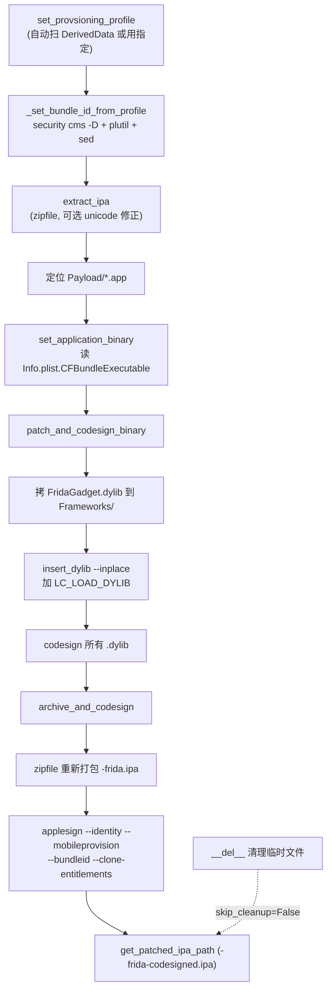

# iOS IPA Patcher <code>objection/utils/patchers/ios.py</code>

实现给 iOS IPA 注入 Frida Gadget 的完整流程：下载 `FridaGadget.dylib`（ios-universal）、解压 IPA、定位 `.app` 主二进制、用 `insert_dylib` 给主二进制加 `LC_LOAD_DYLIB` 加载命令、codesign 所有 dylib、重新打包 IPA、用 `applesign` 配 provisioning profile 重签。仅支持 macOS（依赖 `codesign`/`security`/`plutil` 等系统命令）。

## 📋 模块概览
| 项目 | 值 |
| --- | --- |
| 文件路径 | `objection/utils/patchers/ios.py` |
| 类型 | 工具（IPA 重打包） |
| 被谁调用 | `objection/commands/ios/generate.py`（`objection patchipa` 命令入口） |
| 依赖 | `delegator`、`requests`、`lzma`、`plistlib`、`zipfile`、`click`、`datetime`、`tempfile`、`.base`、`.github` |

## 🎯 解决的问题
- **非越狱注入 Frida**：越狱设备直接 `frida-server`，非越狱需把 `FridaGadget.dylib` 塞进 IPA 并改主二进制加载命令，重签后安装。
- **provisioning profile 自动选取**：开发者机器上 `~/Library/Developer/Xcode/DerivedData/` 可能散落多个 `embedded.mobileprovision`，要挑未过期且剩余天数最多的。
- **bundle id 自动适配**：重签需让 IPA 的 bundle id 与 profile 的 application-identifier 前缀匹配，否则安装失败。本类从 profile 的 `Entitlements.application-identifier` 自动抽 bundle id。
- **dylib 全量 codesign**：IPA 里所有 `.dylib`（不止 gadget）都要重签，否则 dyld 加载时签名校验失败。
- **Unicode 文件名 IPA 解压**：某些 IPA 的 Payload 路径含非 ASCII 字符，`zipfile` 默认用 cp437 解码会乱码，需显式按 utf-8 重解码文件名。

## 🏗️ 核心结构

### `IosGadget` — iOS gadget 下载/管理
源码：[`objection/utils/patchers/ios.py:17`](https://github.com/android-security-engineer/objection-skills/blob/master/objection/utils/patchers/ios.py#L17)

继承 `BasePlatformGadget`。固定路径 `~/.objection/ios/FridaGadget.dylib`（及 `.xz` 压缩包）。无架构概念——Frida 发布的是 `ios-universal.dylib.xz`，单一二进制覆盖 arm64/arm64e。

### `IosGadget._get_download_url` — 挑 ios-universal asset
源码：[`objection/utils/patchers/ios.py:83`](https://github.com/android-security-engineer/objection-skills/blob/master/objection/utils/patchers/ios.py#L83)

```python
def _get_download_url(self) -> str:
    url = ''
    for asset in self.github.get_assets():
        if 'ios-universal.dylib.xz' in asset['name']:
            url = asset['browser_download_url']
    if not url:
        raise Exception('Unable to determine URL for iOS gadget download.')
    return url
```

与 Android 按架构挑不同，iOS 只匹配名字含 `ios-universal.dylib.xz` 的 asset。下载后 `unpack()` 用 `lzma` 解压成 `FridaGadget.dylib`。

### `IosPatcher` — IPA 改造器
源码：[`objection/utils/patchers/ios.py:136`](https://github.com/android-security-engineer/objection-skills/blob/master/objection/utils/patchers/ios.py#L136)

继承 `BasePlatformPatcher`。`required_commands` 声明 8 个依赖，其中 5 个是 macOS 系统自带。

### `IosPatcher.required_commands` — 外部工具依赖
源码：[`objection/utils/patchers/ios.py:139`](https://github.com/android-security-engineer/objection-skills/blob/master/objection/utils/patchers/ios.py#L139)

```python
required_commands = {
    'xcodebuild':  {'installation': 'Install XCode on macOS via the Appstore'},
    'applesign':   {'installation': 'npm install -g applesign'},
    'insert_dylib': {'installation': 'git clone https://github.com/Tyilo/insert_dylib && ...'},
    'codesign':    {'installation': 'Part of XCode'},
    'security':    {'installation': 'macOS builtin command'},
    'zip':         {'installation': 'macOS builtin command'},
    'unzip':       {'installation': 'macOS builtin command'},
    'plutil':      {'installation': 'macOS builtin command'},
}
```

`applesign`（npm 包）做最终 IPA 重签；`insert_dylib`（第三方工具）给 Mach-O 注入 `LC_LOAD_DYLIB`；其余 6 个是 macOS/Xcode 自带。这就是为什么 iOS patch 只能在 macOS 跑。

### `IosPatcher.set_provsioning_profile` — provisioning profile 选取
源码：[`objection/utils/patchers/ios.py:192`](https://github.com/android-security-engineer/objection-skills/blob/master/objection/utils/patchers/ios.py#L192)

```python
def set_provsioning_profile(self, provision_file: str = None, bundle_id: str = None) -> None:
    if provision_file:
        self.provision_file = provision_file
        if bundle_id:
            self.bundle_id = bundle_id
        else:
            self._set_bundle_id_from_profile()
        return

    # 无指定 profile：扫 DerivedData 找 embedded.mobileprovision
    possible_provisions = [os.path.join(dp, f) for dp, dn, fn in
                           os.walk(os.path.expanduser('~/Library/Developer/Xcode/DerivedData/'))
                           for f in fn if 'embedded.mobileprovision' in f]

    # 解码每个 profile，挑未过期且剩余天数最多的
    expirations = {}
    for pf in possible_provisions:
        # security cms -D -i pf 解码
        parsed_data = plistlib.load(...)
        if parsed_data['ExpirationDate'] > current_time:
            expirations[pf] = parsed_data['ExpirationDate'] - current_time

    self.provision_file = sorted(expirations, key=expirations.get, reverse=True)[0]
    if bundle_id:
        self.bundle_id = bundle_id
    else:
        self._set_bundle_id_from_profile()
```

用户提供 profile 则直接用；否则扫 `~/Library/Developer/Xcode/DerivedData/` 下所有 `embedded.mobileprovision`，用 `security cms -D` 解码、`plistlib` 读 `ExpirationDate`，挑剩余天数最多的。bundle id 优先用用户给的，否则从 profile 抽。

### `IosPatcher._set_bundle_id_from_profile` — 从 profile 抽 bundle id
源码：[`objection/utils/patchers/ios.py:450`](https://github.com/android-security-engineer/objection-skills/blob/master/objection/utils/patchers/ios.py#L450)

```python
def _set_bundle_id_from_profile(self):
    # security cms -D -i provision_file 解码
    # 然后 plutil -extract Entitlements.application-identifier xml1
    # grep string | sed 去掉前缀的 TeamID.
    c = delegator.run(['cat', decoded_location]).pipe(
        [self.required_commands['plutil']['location'],
         '-extract', 'Entitlements.application-identifier', 'xml1', '-o', '-', '-']
    ).pipe(['grep', 'string']).pipe(
        ['sed', r's/^<string>[^\.]*\.\(.*\)<\/string>$/\1/g'])

    if len(c.out) > 0:
        self.bundle_id = c.out.strip()
```

profile 的 `application-identifier` 格式是 `<TeamID>.<bundle.id>`（如 `ABCDE12345.com.example.app`），用 sed 去掉 `TeamID.` 前缀得到纯 bundle id。四段管道 `cat | plutil | grep | sed` 用 delegator 的 `.pipe()` 串联。

### `IosPatcher.extract_ipa` — 解压 IPA
源码：[`objection/utils/patchers/ios.py:269`](https://github.com/android-security-engineer/objection-skills/blob/master/objection/utils/patchers/ios.py#L269)

```python
def extract_ipa(self, unzip_unicode, ipa_source: str) -> None:
    shutil.copyfile(ipa_source, self.temp_file)

    if unzip_unicode:
        with zipfile.ZipFile(self.temp_file, 'r') as ipa:
            for info in ipa.infolist():
                info.filename = info.filename.encode('cp437').decode('utf-8')
                ipa.extract(info, self.temp_directory)
    else:
        ipa = zipfile.ZipFile(self.temp_file, 'r')
        ipa.extractall(self.temp_directory)

    # 找 Payload/*.app
    self.payload_directory = os.listdir(os.path.join(self.temp_directory, 'Payload'))
    app_name = ''.join([x for x in self.payload_directory if x.endswith('.app')])
    self.app_folder = os.path.join(self.temp_directory, 'Payload', app_name)
```

`unzip_unicode` 模式：`zipfile` 默认把非 ASCII 文件名按 cp437 解码，这里先 `encode('cp437')` 还原字节再 `decode('utf-8')` 修正成真实文件名。然后定位 `Payload/<App>.app` 目录（若有多个 `.app`，`''.join` 会拼成无效路径——这是已知限制，正常 IPA 只有一个）。

### `IosPatcher.set_application_binary` — 定位主二进制
源码：[`objection/utils/patchers/ios.py:304`](https://github.com/android-security-engineer/objection-skills/blob/master/objection/utils/patchers/ios.py#L304)

用户可指定二进制名，否则解析 `Info.plist` 的 `CFBundleExecutable` 拿主二进制名，拼到 `app_folder` 下。

### `IosPatcher.patch_and_codesign_binary` — 注入 + 签 dylib
源码：[`objection/utils/patchers/ios.py:330`](https://github.com/android-security-engineer/objection-skills/blob/master/objection/utils/patchers/ios.py#L330)

```python
def patch_and_codesign_binary(self, frida_gadget, codesign_signature, gadget_config):
    # 1. 建 Frameworks 目录，拷 FridaGadget.dylib（+ 可选 config）
    os.mkdir(os.path.join(self.app_folder, 'Frameworks'))
    shutil.copyfile(frida_gadget, os.path.join(self.app_folder, 'Frameworks', 'FridaGadget.dylib'))

    # 2. insert_dylib 给主二进制加 LC_LOAD_DYLIB
    load_library_output = delegator.run([
        self.required_commands['insert_dylib']['location'],
        '--strip-codesig', '--inplace',
        '@executable_path/Frameworks/FridaGadget.dylib',
        self.app_binary
    ])
    if 'Added LC_LOAD_DYLIB' not in load_library_output.out:
        click.secho('Injecting the load library might have failed.', fg='yellow')

    # 3. codesign 所有 .dylib
    dylibs_to_sign = [os.path.join(dp, f) for dp, dn, fn in os.walk(self.app_folder)
                      for f in fn if f.endswith('.dylib')]
    for dylib in dylibs_to_sign:
        delegator.run([self.required_commands['codesign']['location'],
                       '-f', '-v', '-s', codesign_signature, dylib])
```

三步：拷 gadget 到 `Frameworks/`、`insert_dylib --inplace` 改主二进制（加 `@executable_path/Frameworks/FridaGadget.dylib` 加载命令，`--strip-codesig` 去掉主二进制原签名避免冲突）、遍历 `.app` 内所有 `.dylib` 用 `codesign -f -v -s <sig>` 强制重签。

### `IosPatcher.archive_and_codesign` — 打包 + applesign 重签
源码：[`objection/utils/patchers/ios.py:395`](https://github.com/android-security-engineer/objection-skills/blob/master/objection/utils/patchers/ios.py#L395)

```python
def archive_and_codesign(self, original_name, codesign_signature):
    # 1. 把 Payload 目录重新 zip 成 IPA
    self.patched_ipa_path = os.path.join(self.temp_directory, '<name>-frida.ipa')
    zipf = zipfile.ZipFile(self.patched_ipa_path, 'w')
    zipdir(os.path.join(self.temp_directory, 'Payload'), zipf)

    # 2. applesign 配 profile + identity 重签整个 IPA
    self.patched_codesigned_ipa_path = os.path.join(self.temp_directory, '<name>-frida-codesigned.ipa')
    delegator.run([
        self.required_commands['applesign']['location'],
        '--identity', codesign_signature,
        '--mobileprovision', self.provision_file,
        '--bundleid', self.bundle_id,
        '--clone-entitlements',
        '--output', self.patched_codesigned_ipa_path,
        self.patched_ipa_path
    ])
```

先用 `zipfile` 把 `Payload/` 重新归档成 `<name>-frida.ipa`，再用 `applesign` 做「带 provisioning profile 的整体重签」——`--clone-entitlements` 复制 profile 的 entitlements，`--bundleid` 覆写 bundle id 以匹配 profile。



## ⚙️ 实现要点
- **`ios-universal` 单二进制**：与 Android 多 ABI 不同，Frida iOS 发布单一 universal dylib（含 arm64 + arm64e fat 切片），patcher 无需按架构选——这让 iOS 流程比 Android 简单一截。
- **`insert_dylib --inplace` 原地改主二进制**：不加 `--inplace` 会生成新文件；`--strip-codesig` 关键——主二进制原有 codesign 在改了 Mach-O 加载命令后失效，必须先剥离，后续 `applesign` 统一重签。
- **所有 dylib 都要 codesign**：不只 gadget，IPA 自带的第三方 `.dylib` 也必须用同一签名重签，否则 dyld 在加载时因签名不匹配拒绝。`os.walk(app_folder)` 全量扫描 `.dylib`。
- **bundle id 必须匹配 profile**：`application-identifier` 是 `<TeamID>.<bundle.id>`，安装时 iOS 校验 bundle id 是否在 profile 允许范围内。`_set_bundle_id_from_profile` 用 sed 去掉 TeamID 前缀得到合法 bundle id，再用 `applesign --bundleid` 覆写到 IPA——保证两者一致。
- **`unzip_unicode` 的 cp437→utf-8 双向转换**：Python `zipfile` 读 zip 文件名时按 cp437 解码（zip 规范的历史遗留），若原始是 utf-8 编码的中文/日文文件名，会显示成乱码。`encode('cp437').decode('utf-8')` 是标准修复手法——把 cp437 错误解出的字符串还原回字节，再按 utf-8 正确解码。
- **`security cms -D` 解码 mobileprovision**：`.mobileprovision` 是 CMS 签名的 plist，不能直接 `plistlib.load`，要用 macOS 的 `security cms -D -i` 解出明文 plist 再解析。这是只在 macOS 能跑的根本原因之一。
- **`__del__` 清理的脆弱性**：与 Android patcher 同样的问题——`__del__` 时机依赖 GC，`self.patched_ipa_path` 若因前序步骤失败为 None，`os.remove(None)` 抛异常被 except 兜住。`--skip-cleanup` 保留临时文件供调试。
- **`tempfile.mkstemp(suffix='.ipa')` 做工作副本**：不直接改源 IPA，先拷到临时文件再操作，源文件保持不变。

## 🔍 源码索引
| 符号 | 位置 |
| --- | --- |
| `IosGadget` | [`objection/utils/patchers/ios.py:17`](https://github.com/android-security-engineer/objection-skills/blob/master/objection/utils/patchers/ios.py#L17) |
| `IosGadget.get_gadget_path` | [`objection/utils/patchers/ios.py:38`](https://github.com/android-security-engineer/objection-skills/blob/master/objection/utils/patchers/ios.py#L38) |
| `IosGadget.gadget_exists` | [`objection/utils/patchers/ios.py:48`](https://github.com/android-security-engineer/objection-skills/blob/master/objection/utils/patchers/ios.py#L48) |
| `IosGadget.download` | [`objection/utils/patchers/ios.py:57`](https://github.com/android-security-engineer/objection-skills/blob/master/objection/utils/patchers/ios.py#L57) |
| `IosGadget._get_download_url` | [`objection/utils/patchers/ios.py:83`](https://github.com/android-security-engineer/objection-skills/blob/master/objection/utils/patchers/ios.py#L83) |
| `IosGadget.unpack` | [`objection/utils/patchers/ios.py:103`](https://github.com/android-security-engineer/objection-skills/blob/master/objection/utils/patchers/ios.py#L103) |
| `IosGadget.cleanup` | [`objection/utils/patchers/ios.py:124`](https://github.com/android-security-engineer/objection-skills/blob/master/objection/utils/patchers/ios.py#L124) |
| `IosPatcher` | [`objection/utils/patchers/ios.py:136`](https://github.com/android-security-engineer/objection-skills/blob/master/objection/utils/patchers/ios.py#L136) |
| `IosPatcher.required_commands` | [`objection/utils/patchers/ios.py:139`](https://github.com/android-security-engineer/objection-skills/blob/master/objection/utils/patchers/ios.py#L139) |
| `IosPatcher.__init__` | [`objection/utils/patchers/ios.py:167`](https://github.com/android-security-engineer/objection-skills/blob/master/objection/utils/patchers/ios.py#L167) |
| `IosPatcher.set_provsioning_profile` | [`objection/utils/patchers/ios.py:192`](https://github.com/android-security-engineer/objection-skills/blob/master/objection/utils/patchers/ios.py#L192) |
| `IosPatcher.extract_ipa` | [`objection/utils/patchers/ios.py:269`](https://github.com/android-security-engineer/objection-skills/blob/master/objection/utils/patchers/ios.py#L269) |
| `IosPatcher.set_application_binary` | [`objection/utils/patchers/ios.py:304`](https://github.com/android-security-engineer/objection-skills/blob/master/objection/utils/patchers/ios.py#L304) |
| `IosPatcher.patch_and_codesign_binary` | [`objection/utils/patchers/ios.py:330`](https://github.com/android-security-engineer/objection-skills/blob/master/objection/utils/patchers/ios.py#L330) |
| `IosPatcher.archive_and_codesign` | [`objection/utils/patchers/ios.py:395`](https://github.com/android-security-engineer/objection-skills/blob/master/objection/utils/patchers/ios.py#L395) |
| `IosPatcher.get_patched_ipa_path` | [`objection/utils/patchers/ios.py:441`](https://github.com/android-security-engineer/objection-skills/blob/master/objection/utils/patchers/ios.py#L441) |
| `IosPatcher._set_bundle_id_from_profile` | [`objection/utils/patchers/ios.py:450`](https://github.com/android-security-engineer/objection-skills/blob/master/objection/utils/patchers/ios.py#L450) |
| `IosPatcher._cleanup_extracted_data` | [`objection/utils/patchers/ios.py:493`](https://github.com/android-security-engineer/objection-skills/blob/master/objection/utils/patchers/ios.py#L493) |
| `IosPatcher.__del__` | [`objection/utils/patchers/ios.py:504`](https://github.com/android-security-engineer/objection-skills/blob/master/objection/utils/patchers/ios.py#L504) |

## 🔗 相关文档
- [整体架构](/guide/architecture)
- [APK Patch（功能详解）](/features/patcher)
- [Patcher 基类](/reference/utils/patchers/base)
- [GitHub Gadget 下载](/reference/utils/patchers/github)
- [Android Patcher](/reference/utils/patchers/android)
