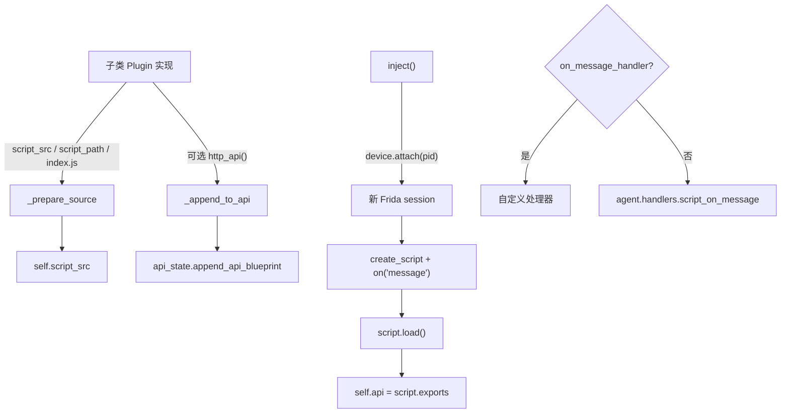

# 插件基类 <code>objection/utils/plugin.py</code>

定义 objection Python 插件的抽象基类 `Plugin`。插件作者继承它、在自己的类里声明 `script_src`/`script_path`/`on_message_handler` 与可选的 `http_api`，本基类负责准备 Frida 脚本源码、把脚本注入新会话、并把插件返回的 Flask Blueprint 追加到核心 API。

## 📋 模块概览
| 项目 | 值 |
| --- | --- |
| 文件路径 | `objection/utils/plugin.py` |
| 类型 | 工具（插件加载基类） |
| 被谁调用 | `objection/commands/plugin_manager.py`（实例化已加载的插件类） |
| 依赖 | `abc.ABC`、`objection.state.connection.state_connection`、`objection.utils.helpers.debug_print`、`objection.state.api.api_state` |

## 🎯 解决的问题
- **统一插件契约**：所有自定义插件都要做三件事——准备脚本、注入会话、（可选）挂 HTTP 端点。把这些固定流程收敛到基类，插件子类只填业务字段。
- **脚本来源灵活**：脚本源码可能直接内联（`script_src`）、来自磁盘路径（`script_path`）、或与插件同目录的 `index.js`——基类按优先级自动解析。
- **消息回调可定制**：默认走 objection 的 `agent.handlers.script_on_message`，但插件可覆盖 `on_message_handler` 自行处理 Frida 消息。
- **插件能扩展 HTTP API**：插件实现 `http_api()` 返回 Flask Blueprint，基类自动注册到 `ApiState`，无需插件作者碰核心路由注册。

## 🏗️ 核心结构

### `Plugin(ABC)` — 插件抽象基类
源码：[`objection/utils/plugin.py:9`](https://github.com/android-security-engineer/objection-skills/blob/master/objection/utils/plugin.py#L9)

不可直接实例化（`ABC`），子类实例化时传入插件文件路径、命名空间、实现字典。构造函数把三个脚本相关字段做「未设置则置 None」的兜底，然后 `_prepare_source()` 解析脚本源码、`_append_to_api()` 注册 HTTP 蓝图。

```python
class Plugin(ABC):
    """ Plugin object to extend for development of custom functionality """

    def __init__(self, plugin_file: str, namespace: str, implementation: dict):
        self.namespace = namespace
        self.implementation = implementation
        self.plugin_file = plugin_file

        # plugin properties
        if not hasattr(self, 'script_src'):
            self.script_src = None
        if not hasattr(self, 'script_path'):
            self.script_path = None
        if not hasattr(self, 'on_message_handler'):
            self.on_message_handler = None

        self.agent = None
        self.session = None
        self.script = None
        self.api = None

        self._prepare_source()
        self._append_to_api()
```

`hasattr` 兜底允许子类在类体里直接声明 `script_src = "..."` 而不被 `__init__` 覆盖。

### `_prepare_source` — 解析脚本源码
源码：[`objection/utils/plugin.py:41`](https://github.com/android-security-engineer/objection-skills/blob/master/objection/utils/plugin.py#L41)

按三级优先级解析 Frida 脚本源码：

```python
def _prepare_source(self):
    if self.script_src:
        return

    if self.script_path:
        self.script_path = os.path.abspath(self.script_path)
        with open(self.script_path, 'r', encoding='utf-8') as f:
            self.script_src = '\n'.join(f.readlines())
        return

    possible_src = os.path.abspath(os.path.join(
        os.path.abspath(os.path.dirname(self.plugin_file)), 'index.js'))
    if os.path.exists(possible_src):
        self.script_path = possible_src
        with open(self.script_path, 'r', encoding='utf-8') as f:
            self.script_src = '\n'.join(f.readlines())
        return

    debug_print('[warning] No Fridascript could be found for plugin {0}'.format(self.namespace))
```

三级回退：内联 `script_src` → 指定 `script_path` → 插件文件同目录的 `index.js`。三级都失败仅打 debug 警告（不抛异常），因为有些插件可能只扩展 HTTP API 而不注入脚本——`inject()` 时才检查 `script_src` 非空。

### `inject` — 注入脚本到新 Frida 会话
源码：[`objection/utils/plugin.py:77`](https://github.com/android-security-engineer/objection-skills/blob/master/objection/utils/plugin.py#L77)

把脚本源码注入一个新的 Frida 会话，绑定消息处理器，加载脚本并取出 RPC exports：

```python
def inject(self) -> None:
    if not self.script_src:
        raise Exception('Unable to discover Frida script source to inject')

    if not self.agent:
        self.agent = state_connection.get_agent()

    self.session = self.agent.device.attach(self.agent.pid)
    self.script = self.session.create_script(source=self.script_src)

    # check for a custom message handler, otherwise fallback
    # to the default objection handler
    self.script.on('message',
                   self.on_message_handler if self.on_message_handler else self.agent.handlers.script_on_message)

    self.script.load()
    self.api = self.script.exports
```

关键点：插件注入的是**独立会话**（`device.attach(self.agent.pid)`），与 objection 主 agent 的会话并存；`self.api = self.script.exports` 让插件子类可直接调用自己脚本里 `rpc.exports` 暴露的方法。

### `_append_to_api` — 注册插件 HTTP 蓝图
源码：[`objection/utils/plugin.py:101`](https://github.com/android-security-engineer/objection-skills/blob/master/objection/utils/plugin.py#L101)

若子类定义了 `http_api` 方法（且可调用），调用它拿到 Flask Blueprint，追加到 `api_state`：

```python
def _append_to_api(self):
    if not hasattr(self, 'http_api'):
        return

    if not callable(getattr(self, 'http_api')):
        raise Exception('The http_api property must be a function returning a Flask Blueprint')

    api_state.append_api_blueprint(getattr(self, 'http_api')())
```

`ApiState` 负责后续加载并启动带这些蓝图的核心 API。插件作者只需 `def http_api(self): bp = Blueprint(...); ...; return bp` 即可。



## ⚙️ 实现要点
- **`hasattr` 兜底而非赋默认值**：用 `if not hasattr(self, 'script_src')` 而不是直接 `self.script_src = None`，是为了不覆盖子类在类体里声明的值——子类设了就用子类的，没设才置 None。
- **`index.js` 约定**：插件文件 `plugin_file` 的目录下找 `index.js`，这是 objection 插件的目录约定（插件入口 `.py` 旁放 Frida 脚本）。
- **独立会话而非复用主 agent 会话**：`inject` 自己 `device.attach`，插件脚本的崩溃/卸载不影响主 agent，但也意味着插件与主 agent 不共享 RPC exports 命名空间。
- **`http_api` 必须返回 Blueprint**：这是硬契约，返回别的类型会触发 `api_state` 注册时出错；本方法只做 `callable` 校验。
- **构造期即注册蓝图**：`_append_to_api` 在 `__init__` 调用，意味着插件实例化那一刻蓝图就进了 `api_state`，早于 HTTP 服务器启动——保证蓝图在首次 `register_blueprint` 时已就位。

## 🔍 源码索引
| 符号 | 位置 |
| --- | --- |
| `Plugin` | [`objection/utils/plugin.py:9`](https://github.com/android-security-engineer/objection-skills/blob/master/objection/utils/plugin.py#L9) |
| `Plugin.__init__` | [`objection/utils/plugin.py:12`](https://github.com/android-security-engineer/objection-skills/blob/master/objection/utils/plugin.py#L12) |
| `Plugin._prepare_source` | [`objection/utils/plugin.py:41`](https://github.com/android-security-engineer/objection-skills/blob/master/objection/utils/plugin.py#L41) |
| `Plugin.inject` | [`objection/utils/plugin.py:77`](https://github.com/android-security-engineer/objection-skills/blob/master/objection/utils/plugin.py#L77) |
| `Plugin._append_to_api` | [`objection/utils/plugin.py:101`](https://github.com/android-security-engineer/objection-skills/blob/master/objection/utils/plugin.py#L101) |

## 🔗 相关文档
- [整体架构](/guide/architecture)
- [插件管理命令](/reference/commands/plugin-manager)
