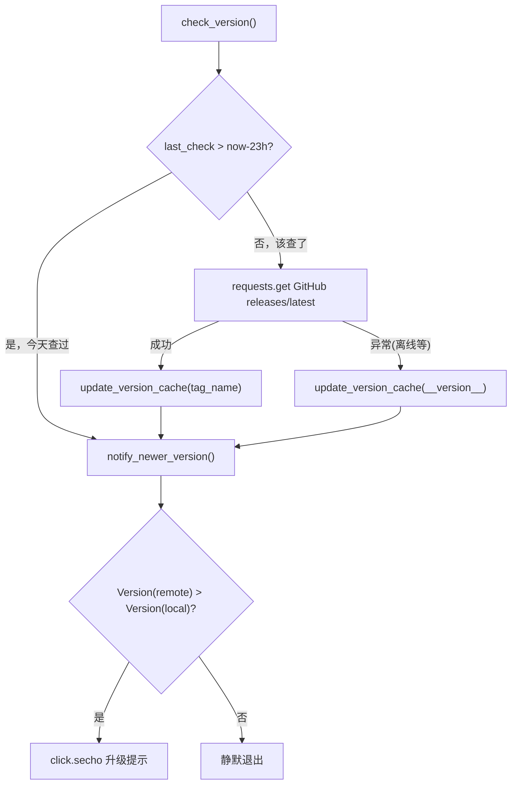

# 版本检查器 <code>objection/utils/update_checker.py</code>

检查 objection 是否有新版本发布。通过 GitHub Releases API 查询最新 tag，结果缓存到本地 `~/.objection/version_info` 文件，23 小时内不重复请求网络，避免每次启动都打扰用户。

## 📋 模块概览
| 项目 | 值 |
| --- | --- |
| 文件路径 | `objection/utils/update_checker.py` |
| 类型 | 工具（启动期版本检查） |
| 被谁调用 | `objection/console/cli.py`（CLI 启动入口调用 `check_version()`） |
| 依赖 | `click`、`requests`、`packaging.version.Version`、`objection.__init__.__version__` |

## 🎯 解决的问题
- **避免每次启动都打网络**：CLI 启动本就慢，再发一次 HTTP 请求查 GitHub 更糟。用本地缓存 + 23 小时窗口，把网络请求降到一天一次。
- **无网络环境不报错**：离线机器上 `requests.get` 会抛异常，本模块静默捕获并把当前版本写成「最新」，后续不再烦人。
- **版本比较要正确**：字符串比较会被 `0.10.0` < `0.9.0` 这类坑到，用 `packaging.version.Version` 做语义比较。
- **用户能看到升级提示**：检测到新版本时用 `click.secho` 绿色高亮打印，附带升级命令。

## 🏗️ 核心结构

### 模块级常量与默认状态
源码：`objection/utils/update_checker.py:11`

```python
objection_path = os.path.join(os.path.expanduser('~'), '.objection')
version_file = os.path.join(objection_path, 'version_info')

version_data = {
    'remote_version': '0.0.0',
    'last_check': datetime.now() - timedelta(days=7)
}

date_fmt = '%d%m%y %H:%M:%S'
```

- `version_file`：缓存文件路径 `~/.objection/version_info`。
- `version_data`：模块级默认值，`last_check` 设为 7 天前，保证首次运行（无缓存文件）必然触发一次网络检查。
- `date_fmt`：缓存里 `last_check` 的序列化格式 `DDMMYY HH:MM:SS`。

### `cached_version_data` — 读缓存
源码：`objection/utils/update_checker.py:22`

```python
def cached_version_data() -> version_data:
    if not os.path.exists(version_file):
        return version_data

    with open(version_file, 'r') as f:
        data = json.load(f)

    data['last_check'] = datetime.strptime(data['last_check'], date_fmt)

    return data
```

无缓存文件时返回模块级默认 `version_data`（7 天前）；有则读 JSON 并把 `last_check` 从字符串解析回 `datetime`。

### `update_version_cache` — 写缓存
源码：`objection/utils/update_checker.py:41`

```python
def update_version_cache(version: str) -> None:
    version_data['remote_version'] = version
    version_data['last_check'] = datetime.now().strftime(date_fmt)

    with open(version_file, 'w') as f:
        json.dump(version_data, f)
```

把远端版本号和「现在」写入磁盘。注意 `version_data` 是模块级可变对象，这里先改它再 dump——下次 `cached_version_data` 若文件被删才会回到默认值。

### `notify_newer_version` — 打印升级提示
源码：`objection/utils/update_checker.py:56`

```python
def notify_newer_version() -> None:
    cache_version = cached_version_data()['remote_version']

    if Version(cache_version) > Version(__version__):
        click.secho('\n\nA newer version of objection is available!', fg='green')
        click.secho('You have v{0} and v{1} is ready for download.\n'.format(
            __version__, cache_version), fg='green')
        click.secho('Upgrade with: pip3 install objection --upgrade', fg='green', bold=True)
        click.secho('For more information, please see: '
                    'https://github.com/sensepost/objection/wiki/Updating\n', dim=True)
```

用 `packaging.version.Version` 做语义比较，缓存版本严格大于本地版本才打印。`click.secho` 用绿色 + 加粗 + dim 多级强调。

### `check_version` — 主入口
源码：`objection/utils/update_checker.py:75`

```python
def check_version() -> None:
    # if we have not checked for a new version today
    if not (cached_version_data()['last_check'] > datetime.now() - timedelta(hours=23)):
        click.secho('Checking for a newer version of objection...', dim=True)

        try:
            r = requests.get('https://api.github.com/repos/sensepost/objection/releases/latest').json()
            update_version_cache(r['tag_name'])

        except Exception:
            update_version_cache(__version__)

    notify_newer_version()
```



## ⚙️ 实现要点
- **23 小时窗口而非 24**：用 `< 23h` 而非 `<= 24h`，给定时区/夏令时漂移留 1 小时余量，避免「恰好满 24 小时却因为分钟级漂移而漏查一天」。
- **离线时缓存当前版本**：`except Exception` 把 `__version__` 写成 `remote_version`，这样 `notify_newer_version` 里 `Version(remote) > Version(local)` 必然为 False，不会在离线机器上反复打印「有新版本」（因为缓存里远程=本地）。但代价是：联网恢复后要等 23 小时才重新查。
- **`# noinspection PyBroadException`**：注释表明这是有意吞掉所有异常——版本检查失败不该影响 CLI 启动。
- **模块级 `version_data` 的双重身份**：既是「无缓存时的默认返回值」又是「被 `update_version_cache` 改写的可变状态」。这种写法让 `cached_version_data` 在文件缺失时直接返回模块对象，但 `update_version_cache` 改它后，若不 dump 到文件，下次进程重启状态会丢——好在 `update_version_cache` 总是先改后 dump。
- **`tag_name` 直接当版本号**：GitHub release 的 `tag_name`（如 `1.11.0`）被直接传给 `Version()`，依赖 Frida/objection 的 tag 命名规范；若 tag 带 `v` 前缀，`packaging.version.Version` 也能解析（`v1.11.0` 合法）。

## 🔍 源码索引
| 符号 | 位置 |
| --- | --- |
| `objection_path` | `objection/utils/update_checker.py:11` |
| `version_file` | `objection/utils/update_checker.py:12` |
| `version_data` | `objection/utils/update_checker.py:14` |
| `date_fmt` | `objection/utils/update_checker.py:19` |
| `cached_version_data` | `objection/utils/update_checker.py:22` |
| `update_version_cache` | `objection/utils/update_checker.py:41` |
| `notify_newer_version` | `objection/utils/update_checker.py:56` |
| `check_version` | `objection/utils/update_checker.py:75` |

## 🔗 相关文档
- [整体架构](/guide/architecture)
- [CLI 入口](/reference/console/cli)
